.. _brown-adipocytes:

Brown adipocytes: thermogenic lipolysis
=======================================

.. list-table::
   :widths: 22 78

   * - **Question**
     - When brown fat cells are stimulated to produce heat, which reactions
       change, through which regulatory mechanism, and in what order?
   * - **System**
     - Immortalised mouse brown adipocytes, stimulated with norepinephrine
   * - **Layers**
     - Transcriptome and proteome at 0, 4 and 24 h; metabolome at seven time
       points; six replicates each
   * - **Data**
     - :ref:`Anagho-Mattanovich et al. 2025 <ref-anaghomattanovich2025>`,
       *iScience*
   * - **Network**
     - The organism-wide mouse network
   * - **Notebook**
     - :doc:`studies/brown_adipocytes`, with every table and figure

This page is the summary. Run the analysis with:

.. code-block:: bash

    python notebooks/studies/brown_adipocytes.py

Every number and figure below comes from that notebook. After a rerun,
``python maintenance/refresh_doc_figures.py`` copies the figures here.

The data
--------

Immortalised murine brown adipocytes stimulated with norepinephrine, six
replicates per timepoint: transcriptome (13,182 genes) and proteome (3,321
proteins) at 0, 4 and 24 h, metabolome (171 features) at seven points between
0 and 24 h. These are the measurements of
:ref:`Anagho-Mattanovich et al. 2025 <ref-anaghomattanovich2025>`, whose own
analysis compared five ways of integrating them: post-hoc correlation, PLS
(DIABLO), factor analysis (MOFA), trans-omics, and knowledge graphs.

They are cultured cells, not animals. The main contrast is 24 h of
stimulation against unstimulated cells, at :math:`q \leq 0.05`.

The measurements map onto the organism-wide mouse network built by
``maintenance/build_networks.py --organisms mouse --brenda``: 106,859
molecules and 1.9 million edges, **82% of which connect two different layers**.
The transcripts are matched through their Ensembl ids (12,012 resolved) and the
metabolites by name against the network's compound synonyms (119 of 171).

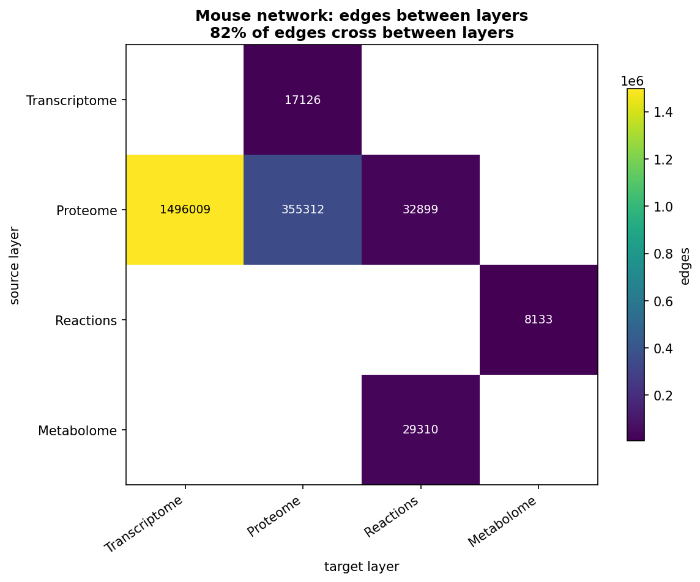

   Edges between layers in the mouse network. The diagonal is edges within a
   layer, dominated by protein interactions.

What the network adds to the lists
----------------------------------

**6,568 molecules respond, joined by 21,383 edges.** A separate analysis of
each layer produces the first number. The second counts the places where the
response in one layer connects to another.

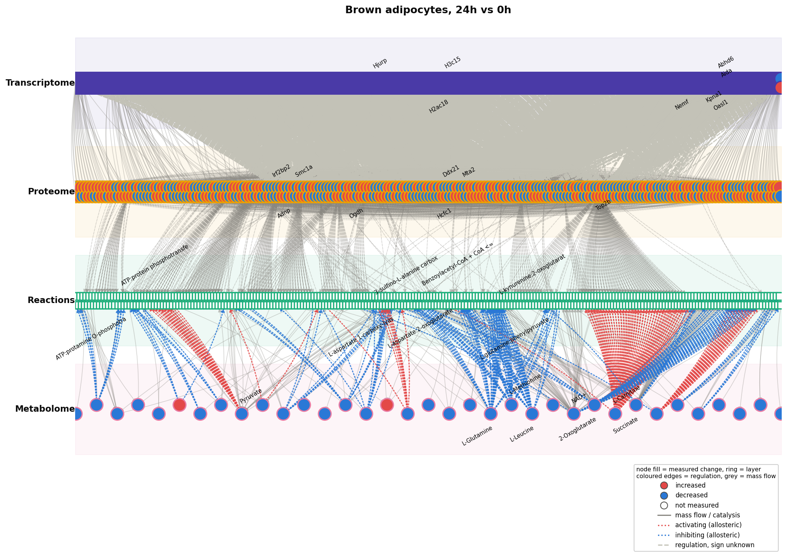

   The most regulated reactions, drawn in the order regulation flows: gene,
   protein, reaction, metabolite. Node fill shows the measured change; dotted
   edges are allosteric regulation.

Most of the large communities in the responsive network are a single
transcription factor with the hundreds of genes it binds. The community with the
most reactions is the metabolic core of the response:

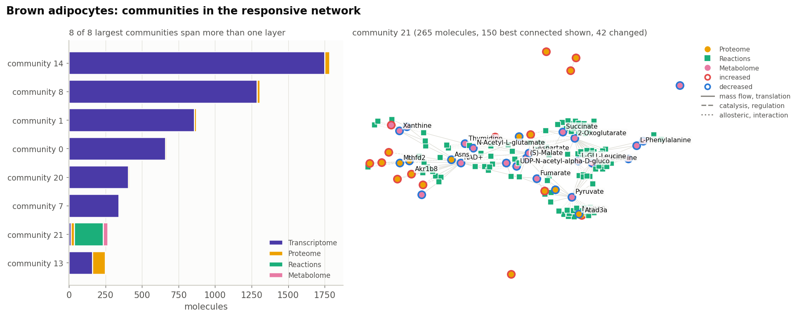

   Left: the layers in each of the largest communities. Right: the community
   with the most reactions. Fill colour is the layer, a red or blue ring marks a
   molecule that went up or down, and the best-connected and changed molecules
   are named.

Which axis regulates each reaction
----------------------------------

**2,393 reactions are regulated**: 1,902 through enzyme amount only, 229
through metabolites only, and 262 through both. In **154** the enzyme axis and
the metabolite axis point in opposite directions, so either layer on its own
would give the wrong answer. Most enzyme-axis calls are supported by both the
transcript and the protein (1,231 ``gene_protein``, 773 ``tf_gene_protein``),
330 by the protein alone.

.. figure:: figures/brown_adipocytes/axis_composition.png
   :width: 70%

   Regulated reactions by the axis that carries them.

As proportions: **90 % of the regulated reactions are enzyme-driven, 21 %
metabolite-driven**, and 6.4 % controversial. This response runs through enzyme
amount. In the trained rat tissues the two axes are nearly balanced.

Grouped by KEGG pathway, the enzyme axis is mostly *down*: steroid and
fatty-acid synthesis lose enzymes entirely, and purine metabolism is the only
large pathway with many enzymes going up. The metabolite axis is more mixed.
Alanine, aspartate and glutamate metabolism has the highest share of
controversial reactions, about half.

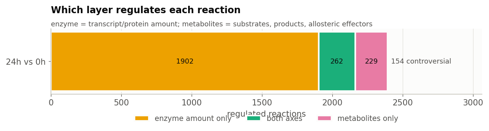

   Regulated reactions per KEGG pathway, for the 15 pathways with the most.
   Left, the enzyme axis; middle, the metabolite axis (red speeds reactions up,
   blue slows them down); right, the fraction where the two axes disagree.

**A caveat on the controversial reactions.** Pyruvate has a log2 fold change of
−20.9: it falls to values near the detection limit at 24 h, so the size of the
change is not meaningful, only its direction. Because pyruvate is the product
of many reactions, it dominates the metabolite axis of most controversial
reactions in the figure below. These reactions are better read as "pyruvate
disappears while the enzyme goes down" than as a balance of two forces.

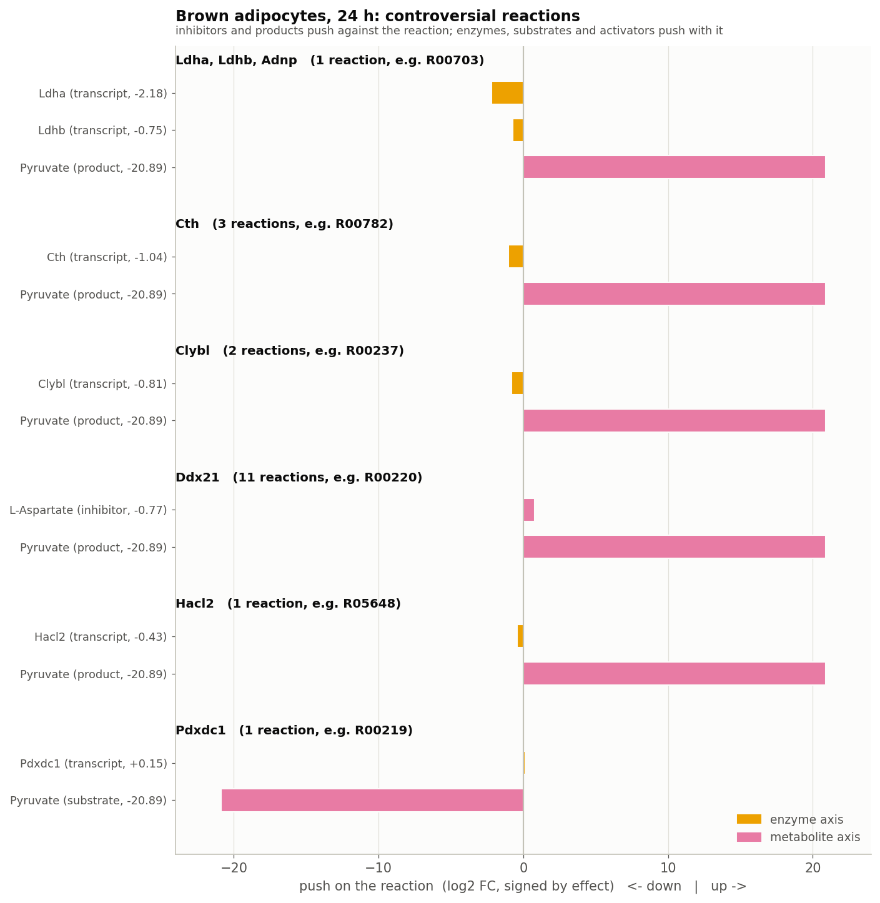

   The controversial reactions, grouped by enzyme. Each bar is one measured
   molecule's push on the reaction; yellow is the enzyme axis, pink the
   metabolite axis.

Of the changed metabolites, 21 of 38 are known allosteric regulators of an
enzyme, against 52 % of all measured metabolites (q = 0.55): no enrichment. The
individual regulators, such as L-carnitine, NAD+ and L-methionine, are still
worth following up.

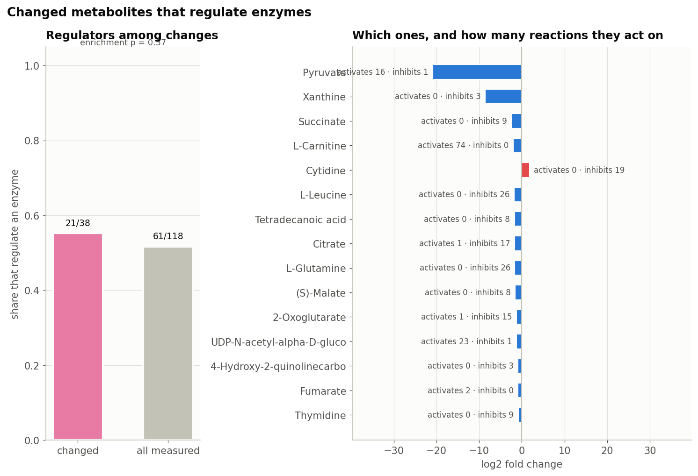

Coverage limits all of this, and the notebook reports it first: 13,002 of 57,540
transcripts on the network are measured and 6,882 respond, against 118 of 19,652
metabolites measured and 38 responding. Every metabolite-axis statement rests on
those 38.

Is each protein change transcriptional?
---------------------------------------

Of the genes measured in both layers, 165 are concordant, 170 change at the
protein level only, 746 at the transcript level only, and **126 move against
their transcript**. Tested directly (protein change minus transcript change,
with standard errors), **292 of 1,661 testable proteins changed significantly
more than their transcript**. That is evidence for regulation after
transcription, provided the two platforms report fold changes on comparable
scales.

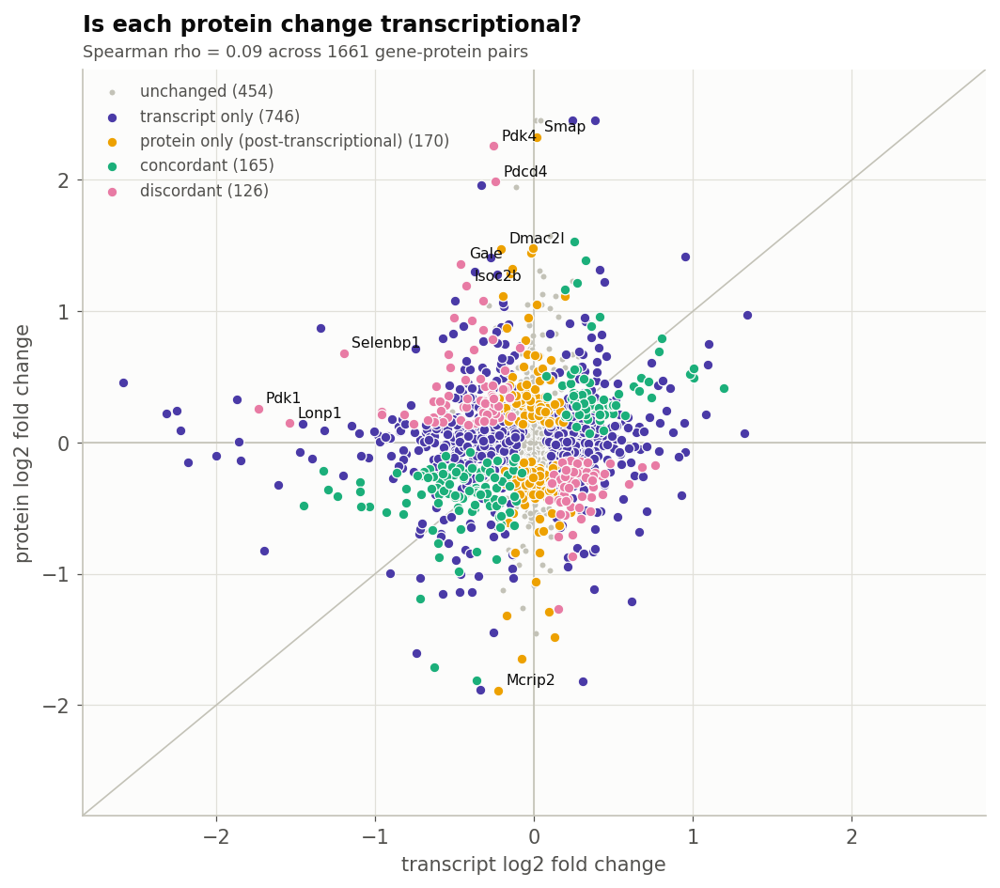

Which molecules hold the response together
------------------------------------------

Two questions about the same responsive network, with different answers.

**Cross-layer hubs** are the molecules with the most connections to other
layers. They are led by the RNA helicase Ddx21 and the transcriptional
co-regulator Hcfc1, each connected to thousands of genes through ChIP-Atlas
binding, and by Ogdh, a subunit of 2-oxoglutarate dehydrogenase, which reaches
three layers: its transcript, its protein and the TCA-cycle reactions it
catalyses. Ogdh is the only metabolic enzyme in the top ten.

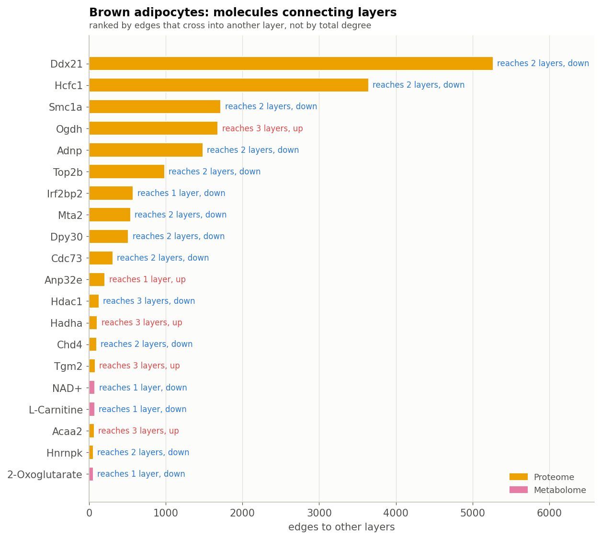

   Molecules ranked by connections to other layers, with the number of layers
   they reach and their measured direction.

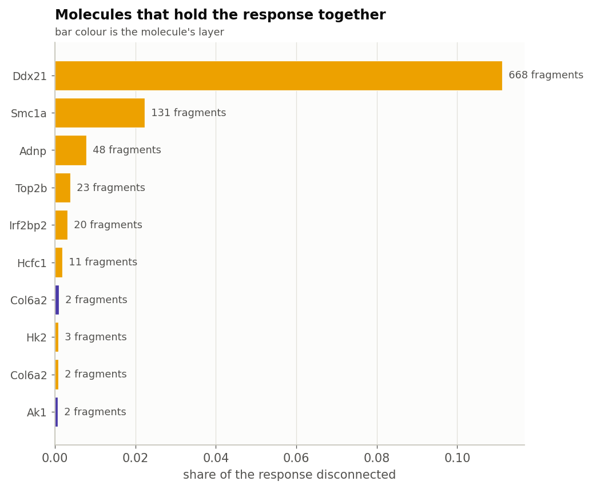

**Structural vulnerability** asks which molecules, if removed, would split the
response into separate pieces. Removing Ddx21 splits it into 668 pieces and cuts
off 11 % of it; Smc1a gives 131 pieces. After those the effect drops steeply:
Hk2 (glycolysis) splits off only three molecules. A few highly connected
regulatory proteins hold this response together, not its metabolic core.

Does the upper hierarchy predict the metabolites?
-------------------------------------------------

Propagating the changed genes and proteins forward along signed edges predicts
a direction for each metabolite they reach. **24 of 32 changed metabolites are
predicted correctly, 75 %, binomial p = 0.007.** This is the only directional
prediction in this study that beats chance; path tracing over the same network
does not (see below).

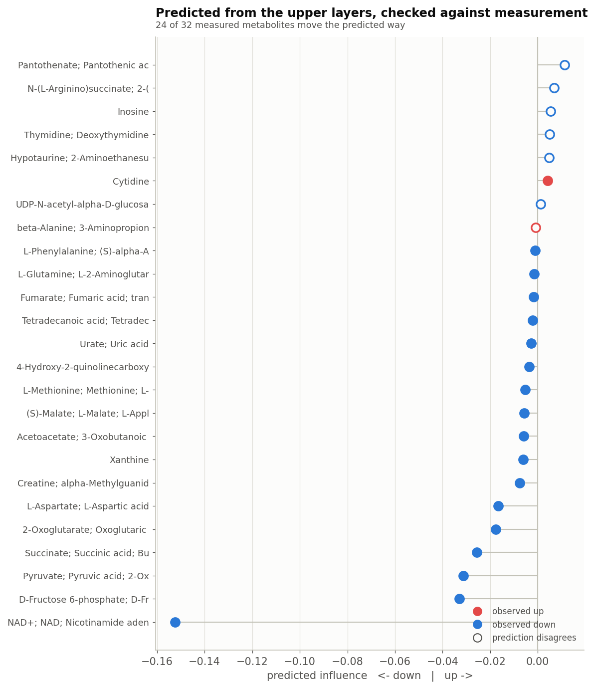

   Predicted score against measured direction for each changed metabolite.

Timing on the network
---------------------

The seven-point metabolome gives 118 metabolites a half-response time. There is
**no association between the number of connections and response time**
(p = 0.227), whereas :ref:`Morita et al. <ref-morita2025>` report one in
liver.

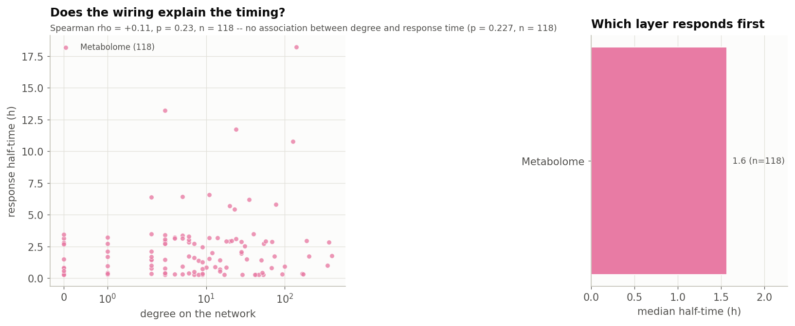

4 h against 24 h
----------------

The early and late responses share a fifth of their edges (Jaccard index
0.20). The typed comparison shows which kinds of regulation differ: the late
response has more than twice the transcription-factor edges of the early one
(17,363 against 7,475), while the early response has more allosteric edges
(730 against 285). Allosteric regulation comes first and transcriptional
regulation follows.

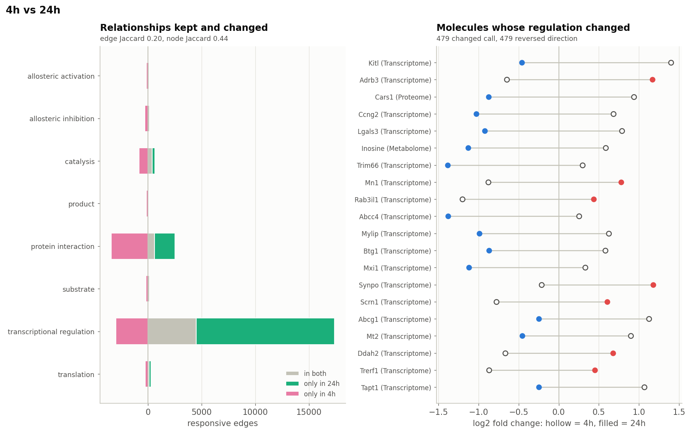

   Edges kept, gained and lost between 4 h and 24 h, by edge type, and the
   molecules that reversed direction.

Factors, read through the network
---------------------------------

The published analysis fitted MOFA factors to these data. A joint factor model
treats ``0h_01`` as the same culture in every layer, and that can be tested:
within a time point, a culture with a high transcript level of a gene should
also tend to have a high level of its protein. The per-gene agreement is 0.067
as listed, against −0.001 under shuffled pairings (p = 0.002, 1,656 genes in
both layers). The layers are the same cultures, so the joint model is sound.

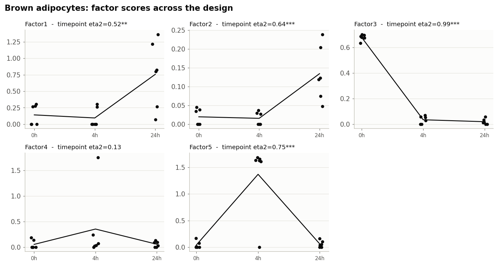

   Five factors across the 18 samples measured in all three layers, by
   timepoint.

Five NMF factors, read four ways:

.. list-table::
   :header-rows: 1
   :widths: 12 20 22 24 22

   * - Factor
     - Layers agree
     - Retained when re-paired
     - Carried by
     - Network overlap vs null
   * - Factor3
     - 0.58
     - 100%
     - between-group
     - 0.139 vs 0.052
   * - Factor5
     - 0.48
     - 92%
     - between-group
     - 0.112 vs 0.053
   * - Factor1
     - 0.20
     - --
     - single-layer
     - 0.060 vs 0.053
   * - Factor2
     - 0.23
     - --
     - single-layer
     - 0.147 vs 0.056
   * - Factor4
     - 0.03
     - --
     - single-layer
     - 0.119 vs 0.053

**Factors 3 and 5 pass every reading.** The layers agree about them, the
agreement comes from the time points, and their molecules from different layers
converge on the network more than random molecules from the same layers
(q = 0.012). Those two are the ones to interpret.

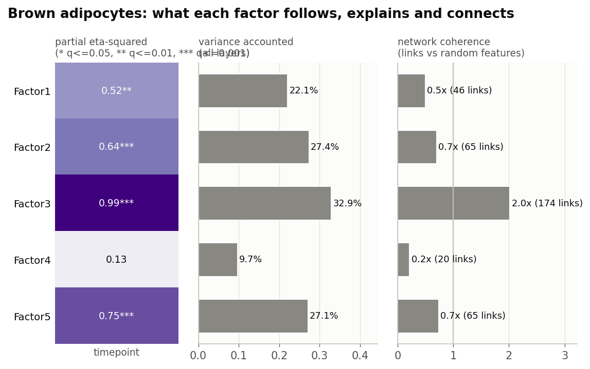

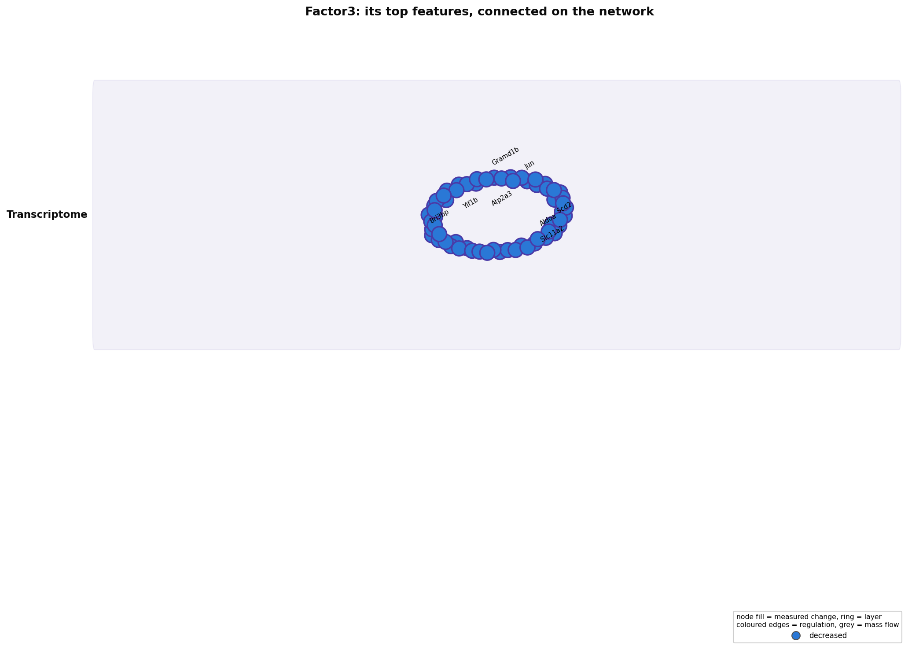

   Factor3 on the network: where its transcripts, proteins and metabolites
   meet. Because the loadings are placed on named network nodes, the factor can
   be read as biochemistry.

Factor 2 is the case worth studying. Its features converge on the network more
strongly than any other, onto branched-chain amino acid catabolism (*Bckdhb*,
3-hydroxyisobutyrate) and the complex III assembly factor *Uqcc4*. Branched-chain
amino acids are a known fuel for heat production in brown fat. But the layers
do not agree about which samples carry the factor, so it reflects one layer
only, even though its molecules are biochemically related. Only reading the
factor on the network separates these two properties.

Motifs, and whether the convergence is real
-------------------------------------------

Two analyses of the structure of the responsive network itself.

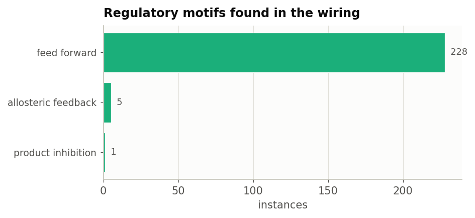

**Motifs.** The search finds one instance of product inhibition and five of
allosteric feedback, all in methionine and cysteine metabolism, with
L-methionine as the regulator. It also finds 228 feed-forward motifs, which
require both the transcription factor and its target enzyme to respond. The
factor inference is permissive on this data (225 factors implicated), so those
228 are a list of candidates.

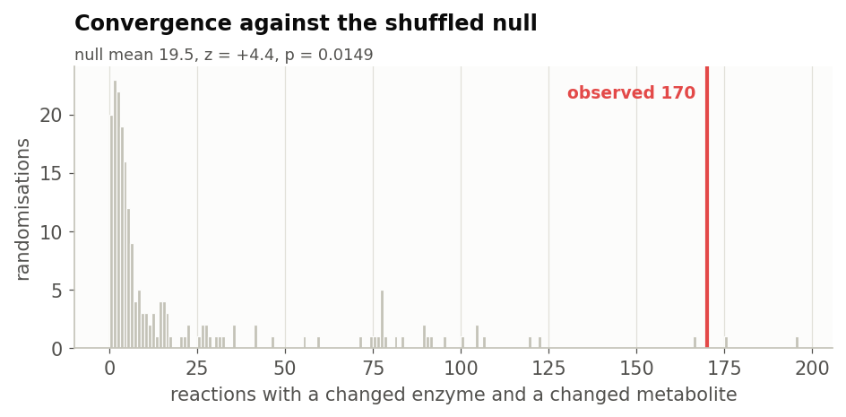

**Is the convergence more than chance?** 170 reactions have both a changed
enzyme and a changed metabolite. Reassigning at random which molecules changed,
with the network and the number of changed molecules per layer fixed, gives 19
on average (z = +4.4, p = 0.015). The layers converge far more than chance
would produce, which is what the regulation-axis results above rely on.

What does not work on this data
-------------------------------

* **Signed paths** (:ref:`signed regulatory paths <signed-paths>`) do not beat
  chance: 19 of 28 changed metabolites predicted in the right direction, 68%,
  binomial p = 0.087. The figure shows the paths one by one, so the wrong
  predictions can be seen individually.

  .. figure:: figures/brown_adipocytes/regulatory_paths.png
     :width: 100%

* **Changed metabolites are not enriched for regulators** (21 of 38 against
  52 % of all measured metabolites, q = 0.55). With BRENDA included, most
  measured metabolites are a known regulator of some enzyme, so the test has
  little room to show enrichment.
* **Response time does not follow connectivity** (p = 0.227, n = 118).
* **Transcription-factor inference is too permissive here**: 225 of 703 factors
  reach q <= 0.05. With 6,882 responding transcripts and thousands of ChIP-Atlas
  targets per factor, the ranking is informative but the count is not.

  .. figure:: figures/brown_adipocytes/tf_activity.png
     :width: 90%

.. seealso::

   :doc:`motrpac_study` runs the same catalogue across six tissues.
   :doc:`obese_liver_panel` and :doc:`liver_timecourse` apply it to lean and
   obese mouse liver.
