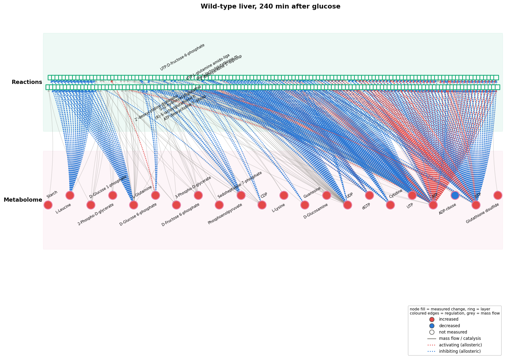
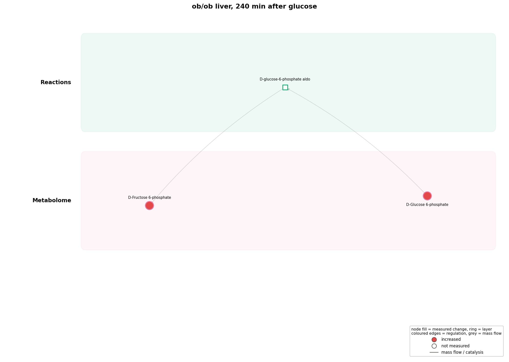
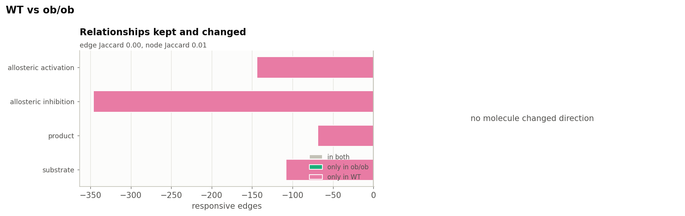
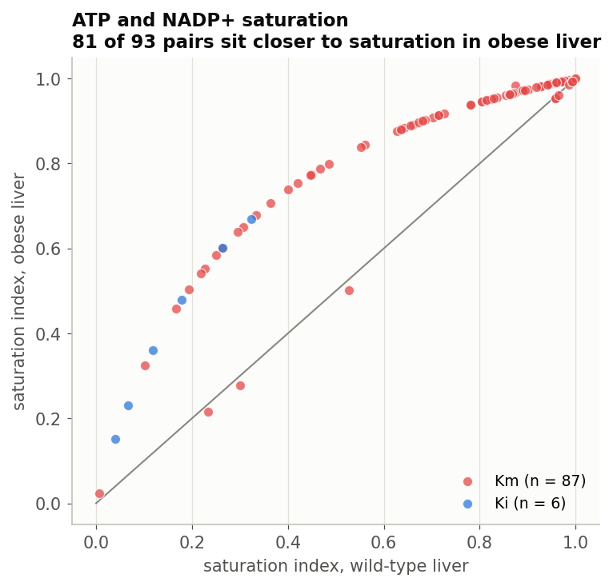
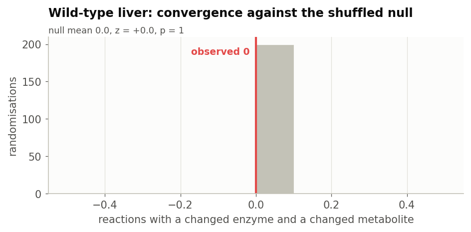
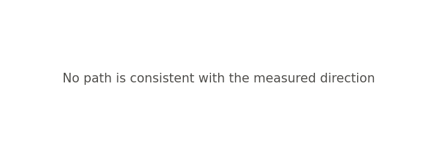
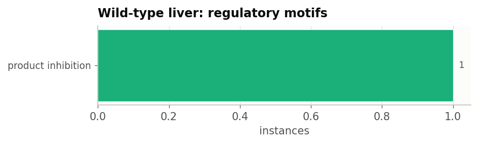

.. _kokaji-study:

Kokaji liver: one response, two genotypes
=========================================

Wild-type and leptin-deficient obese (ob/ob) mouse liver, sampled at 0, 20, 60,
120 and 240 minutes after an oral glucose bolus. 14,292 genes and 162
metabolites, with the authors' own fold changes, q-values and half-response
times, plus eleven signalling proteins measured by western blot.

:doc:`published_study` scores three claims from this study on a 19-gene panel at
one timepoint and has to mark them "not reproduced here". This page uses the
study's own data.

.. code-block:: bash

    python notebooks/studies/kokaji_liver.py

.. tip::

   This page is the summary. :doc:`The full notebook <studies/kokaji_liver>` runs
   every analysis in the catalogue on this data, with all of its tables and
   figures.

.. admonition:: Provenance of the data and of these figures

   The measurements are those of
   :ref:`Kokaji et al. 2020 <ref-kokaji2020>`. TransNet **never redistributes
   them**: the loader downloads the supplementary tables at run time into a
   directory that is not part of this repository. The preprint of the same study
   carries the same tables openly, so a reader without a subscription can run
   the analysis.

   The figures here are TransNet's own: fold changes read from the supplement,
   mapped and analysed by this package.

The data, and what is not in it
-------------------------------

Two things about this dataset shape everything below.

**The metabolome arrives with KEGG compound identifiers.** Name matching is
usually the limiting step for the metabolite layer; here all 162 metabolites map,
and 98% of the 14,292 transcripts resolve through Ensembl to Entrez.

**There is no proteome.** The eleven western blots are a signalling readout, not
a proteome, so the enzyme axis rests on transcripts alone. That is recorded in
``gene_axis_evidence`` and it makes these counts incomparable with a study that
measured proteins. It also means one analysis cannot run at all; see below.

Nothing is recomputed. The supplement gives a fold change, p-value and q-value
per timepoint per genotype, so the contrast is read off it and converted from a
ratio to log2. What differs from the paper is the network reading, not the
statistics.

.. list-table:: 240 minutes after glucose, against 0 minutes
   :header-rows: 1
   :widths: 16 22 20 20 22

   * - Genotype
     - Layer
     - Features
     - q <= 0.1
     - and 1.5-fold
   * - WT
     - Metabolome
     - 162
     - 36
     - 26
   * -
     - Transcriptome
     - 14,292
     - 425
     - 284
   * - ob/ob
     - Metabolome
     - 162
     - 11
     - 8
   * -
     - Transcriptome
     - 14,292
     - 552
     - 399

The paper's headline is visible before any network: the wild-type metabolome
moves more than the obese one, 36 metabolites against 11, while the obese
transcriptome moves more than the wild-type one, 552 genes against 425.

Which axis regulates each reaction
----------------------------------

.. list-table::
   :header-rows: 1
   :widths: 14 14 16 18 12 16

   * - Genotype
     - Regulated
     - Enzyme axis only
     - Metabolite axis only
     - Both
     - Controversial
   * - WT
     - 1,202
     - 790
     - 304
     - 108
     - 62
   * - ob/ob
     - 844
     - 756
     - 75
     - 13
     - 8

.. figure:: figures/kokaji/axes_by_genotype.png
   :width: 70%

As proportions, **metabolite-driven regulation falls from 34% of regulated
reactions in wild-type liver to 10% in obese liver, while gene-driven regulation
rises from 75% to 91%**. Controversial reactions fall from 5.2% to 0.9%.

This is the claim the study is built on, and the 19-gene panel in
:doc:`published_study` could not test it. Here the whole liver is available and
both axes can be counted in each genotype.

   Wild-type liver, 240 minutes after glucose.

   Obese liver, the same contrast, on the same network.

The two genotypes as networks
-----------------------------

The typed comparison states the loss more sharply than any proportion:

.. list-table::
   :header-rows: 1
   :widths: 30 18 18 18 18

   * - Relationship
     - WT
     - ob/ob
     - Shared
     - Lost in ob/ob
   * - allosteric_inhibition
     - 346
     - 0
     - 0
     - 346
   * - allosteric_activation
     - 144
     - 0
     - 0
     - 144
   * - substrate
     - 109
     - 1
     - 1
     - 108
   * - product
     - 70
     - 1
     - 1
     - 69

   Relationships kept, lost and reversed between the genotypes.

**Obese liver has no allosteric regulatory edge in its response at all**, where
wild-type liver has 490. Edge Jaccard between the two responses is 0.00. A
comparison by molecule count would report 844 regulated reactions against 1,202
and miss that the entire allosteric arm is gone.

Do the changed metabolites regulate anything?
---------------------------------------------

In wild-type liver 14 of 26 changed metabolites act on an enzyme, against 49% of
all measured metabolites (q = 0.54); in obese liver 3 of 8 (q = 0.85). Neither
is enriched. The named regulators are worth following individually; the set as a
whole shows nothing.

.. figure:: figures/kokaji/metabolite_regulators.png
   :width: 100%

   Wild-type liver: the share that regulate an enzyme, against the background,
   with the regulators named.

Saturation, and the currency metabolites
----------------------------------------

Table S13 gives measured Km and Ki values with a saturation index per genotype,
for ATP and NADP+. Those two are what TransNet treats as *currency* metabolites
and excludes from the metabolite axis, on the grounds that everything uses them
and a change in ATP is not a regulatory statement about any particular reaction.

The saturation index tests that decision rather than assuming it. Across 93
enzyme-metabolite pairs, mean ATP saturation is **0.71 in wild-type liver and
0.87 in obese liver** by Km, and 0.17 against 0.42 by Ki; NADP+ is unchanged at
0.82. 87 of the regulated reactions carry a measured index, and the largest
shifts, about +0.34, are all ATP-dependent kinases and ligases.

   Every enzyme-metabolite pair, against the diagonal. 81 of 93 sit above it.

Obese liver therefore sits *closer* to ATP saturation, where a further change in
ATP has less effect on rate, not more. The shift is systematic rather than
driven by a handful of enzymes: only 12 of the 93 pairs move the other way. Excluding ATP from the metabolite axis is
the right call on this data, and here it is a measurement rather than a
convention.

Transcription factors, against a published inference
----------------------------------------------------

Every other transcription-factor result in this documentation is unvalidated:
the ranking looks plausible and nothing says whether it is right. The authors
inferred factors from the same transcriptome by motif enrichment over gene
clusters, so the two inferences can be compared.

Ten of 708 testable factors are implicated in wild-type liver at q <= 0.05, nine
in obese liver.

.. list-table::
   :header-rows: 1
   :widths: 40 20 40

   * - Factor
     - Responsive targets
     - q
   * - Jarid2
     - 172 of 1,101
     - 7e-21
   * - Suz12
     - 146 of 930
     - 1e-17
   * - Cbx7
     - 136 of 851
     - 3e-17
   * - Rnf2
     - 216 of 1,764
     - 4e-14
   * - Mtf2
     - 100 of 642
     - 1e-11
   * - Eed
     - 75 of 440
     - 2e-10

Every one of the top hits is a Polycomb component: Jarid2, Suz12, Eed, Ezh2 and
Mtf2 belong to PRC2, and Cbx7, Rnf2, Pcgf2, Bmi1 and Phc1 to PRC1. Polycomb
complexes occupy thousands of CpG-island promoters, so a large responsive gene
set is enriched for them whatever the biology.

**The two inferences agree on nothing.** Fourteen factors are testable in both
analyses. The authors call all fourteen enriched; this analysis implicates none
of them, and implicates ten factors they do not.

.. figure:: figures/kokaji/tf_activity.png
   :width: 100%

   Factors behind the responsive genes in wild-type liver. Those passing
   correction are named in ink, the rest in grey.

That is the most useful result on this page. A ChIP-Atlas target-set test and a
promoter-motif test, run on one dataset, select disjoint sets of factors. Neither
is thereby wrong, but a transcription-factor ranking from either method should be
treated as a hypothesis about which factors to check, not as an answer.

Timing, against the authors' own half-response times
----------------------------------------------------

Every other timing result here uses half-response times this package computed.
The supplement distributes them, per genotype, for both layers.

.. list-table::
   :header-rows: 1
   :widths: 18 24 20 20

   * - Genotype
     - Layer
     - With a t-half
     - Median (min)
   * - WT
     - Metabolome
     - 64
     - 13.2
   * -
     - Transcriptome
     - 1,255
     - 26.8
   * - ob/ob
     - Metabolome
     - 46
     - 14.7
   * -
     - Transcriptome
     - 2,511
     - 15.9

The layer ordering is the paper's: in wild-type liver the metabolome responds at
13 minutes and the transcriptome at 27. In obese liver the transcriptome speeds
up to 16 minutes while the metabolome does not move, which is the temporal form
of the same shift the axis counts show.

:ref:`Morita et al. <ref-morita2025>` report that the best-connected molecules
respond first in healthy liver. On these values and this network's degrees there
is no association in either genotype or either layer (:math:`\rho` between
-0.16 and 0.00, p >= 0.09).

What does not work on this data
-------------------------------

* **The convergence null cannot run.** Its enzyme side is a catalysis edge,
  which comes from the Proteome, and this study has none, so it scores 0
  convergent reactions by construction. The function now warns when that
  happens, because a zero here is not a measurement.
* **Signed paths score no metabolite.** 5,788 paths are traced in wild-type
  liver and 1,388 in obese liver, and none reaches a changed metabolite with a
  usable prediction. The paths exist and predict; the metabolome coverage does
  not reach far enough to check them. Propagation does reach metabolites and
  gets 8 of 22 right in wild-type liver and 2 of 6 in obese liver, both at or
  below chance.
* **Structural vulnerability finds nothing**, for the same reason as the
  convergence null: without an enzyme layer the responsive subnetwork has no
  chain to cut.
* **Cross-layer hubs are currency metabolites.** ATP, GTP, UTP and UDP lead the
  wild-type ranking on cross-layer degree alone. In obese liver, where the
  allosteric edges are absent, the ranking falls back to fructose 6-phosphate
  and glucose 6-phosphate.
* **Regulatory motifs are almost absent**: one instance of product inhibition in
  wild-type liver and two in obese liver.

   The null is degenerate: with no proteome, no enzyme is ever measured as
   changed, so no reaction can converge.

   Wild-type liver: what each path predicts, with no measured metabolite to
   check it against.

The published claims, scored
----------------------------

.. list-table::
   :header-rows: 1
   :widths: 44 16 40

   * - Claim
     - Verdict
     - This analysis
   * - Healthy hepatic glucose responses rely on regulation by metabolites
     - reproduced
     - 34% of regulated reactions in WT carry a changed metabolite, 490
       allosteric edges in the response
   * - In ob/ob liver, regulation by metabolites is lost
     - reproduced
     - 10% against 34%, and not one allosteric edge in the obese response
   * - ob/ob glucose responses depend instead on slow gene expression
     - reproduced
     - 91% of obese regulated reactions carry a changed transcript against 75%
       in WT, over 14,292 genes, with 552 responding against 425

All three are reproduced, where :doc:`published_study` could test none of them
on a 19-gene panel at one timepoint. The instrument was the problem, not the
claims.

.. seealso::

   :doc:`published_study` reproduces the Uematsu panel on the same organism, and
   :doc:`motrpac_study` runs the catalogue across six tissues with
   phosphoproteomics.
