.. _liver-timecourse:

Obese liver after a glucose load: a genome-wide time course
===========================================================

.. list-table::
   :widths: 22 78

   * - **Question**
     - How does the liver's response to glucose differ between lean and obese
       mice, genome-wide and over time, and which regulatory mechanisms carry
       each response?
   * - **System**
     - Liver of wild-type and leptin-deficient obese (ob/ob) mice, 0, 20, 60,
       120 and 240 minutes after an oral glucose load
   * - **Layers**
     - Transcriptome (14,292 genes) and metabolome (162 compounds), with the
       authors' fold changes, q-values and half-response times; no proteome
   * - **Data**
     - :ref:`Kokaji et al. 2020 <ref-kokaji2020>`, *Science Signaling*
   * - **Network**
     - The organism-wide mouse network, one copy per genotype
   * - **Notebook**
     - :doc:`studies/liver_timecourse`, with every table and figure

:doc:`obese_liver_panel` could check three claims of this paper only partly, on
19 genes at one time point. This page tests them on the data they were made
from. Run the analysis with:

.. code-block:: bash

    python notebooks/studies/liver_timecourse.py

.. admonition:: Provenance of the data and of these figures

   The measurements are those of
   :ref:`Kokaji et al. 2020 <ref-kokaji2020>`. TransNet **never redistributes
   them**: the loader downloads the supplementary tables at run time into a
   directory that is not part of this repository. The preprint of the same study
   carries the same tables openly, so a reader without a subscription can run
   the analysis.

   The figures here are TransNet's own: fold changes read from the supplement,
   then mapped and analysed by this package.

The data, and what is not in it
-------------------------------

Two properties of this dataset shape everything below.

**The metabolites come with KEGG compound ids**, which the network also uses, so
all 162 map without name matching; 98 % of the 14,292 transcripts map through
their Ensembl ids.

**There is no proteome.** The study's eleven western blots measure signalling
proteins, not enzymes, so the enzyme axis rests on transcripts alone. This is
recorded in ``gene_axis_evidence``, and it means these counts cannot be compared
directly with a study that measured proteins. It also means that the
convergence test cannot run (see below).

No statistics are recomputed. The supplement gives a fold change, p-value and
q-value per time point and genotype, so each contrast is read from it and the
ratio converted to log2. The analysis differs from the paper only in what is
done with the network.

.. list-table:: 240 minutes after glucose, against 0 minutes
   :header-rows: 1
   :widths: 16 22 20 20 22

   * - Genotype
     - Layer
     - Features
     - q <= 0.1
     - and 1.5-fold
   * - WT
     - Metabolome
     - 162
     - 36
     - 26
   * -
     - Transcriptome
     - 14,292
     - 425
     - 284
   * - ob/ob
     - Metabolome
     - 162
     - 11
     - 8
   * -
     - Transcriptome
     - 14,292
     - 552
     - 399

The paper's main finding is visible before any network is used: more
metabolites change in lean than in obese liver (36 against 11), and more genes
change in obese than in lean liver (552 against 425).

The response over time
----------------------

Over the four hours, lean liver accumulates sugar phosphates (glucose 6-, glucose
1- and fructose 6-phosphate), starch and urate, with the changes growing over
time. In obese liver the same metabolites barely move.

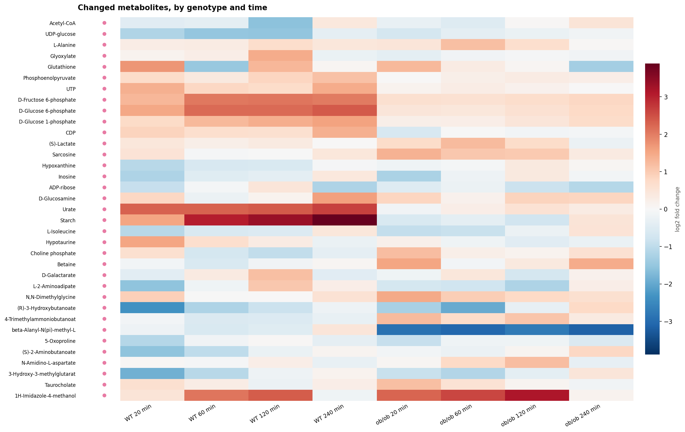

   Every metabolite that changed at some time point, as log2 fold change
   against 0 minutes, by genotype and time.

The gene responses differ in another way. In obese liver the genes that change
at 20, 60 and 120 minutes overlap strongly (Jaccard index up to 0.40): the same
genes respond throughout the first two hours. In lean liver consecutive time
points share at most a quarter of their genes, so the response moves from one
set of genes to the next. Between the genotypes the overlap is at most 0.12.

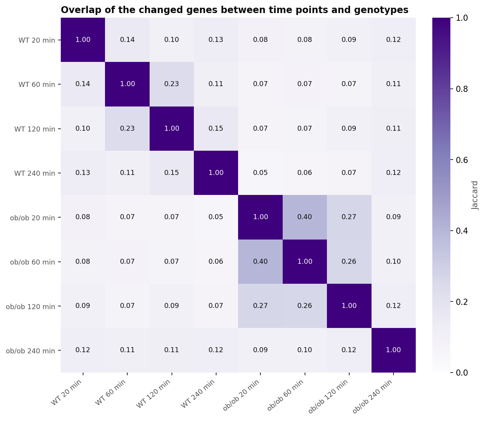

   Overlap of the changed genes (Jaccard index) between every pair of time
   points and genotypes.

Which axis regulates each reaction
----------------------------------

.. list-table::
   :header-rows: 1
   :widths: 14 14 16 18 12 16

   * - Genotype
     - Regulated
     - Enzyme axis only
     - Metabolite axis only
     - Both
     - Controversial
   * - WT
     - 1,202
     - 790
     - 304
     - 108
     - 62
   * - ob/ob
     - 844
     - 756
     - 75
     - 13
     - 8

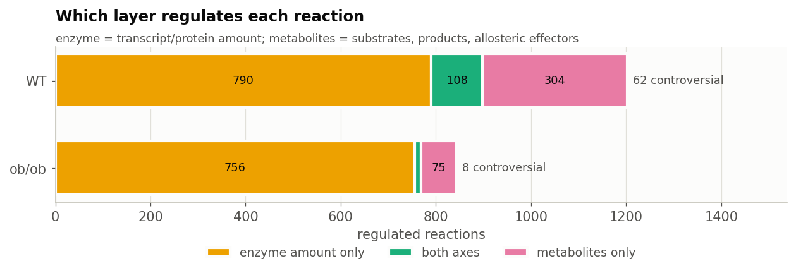

As proportions, **metabolite-driven regulation falls from 34 % of regulated
reactions in lean liver to 10 % in obese liver, while enzyme-driven regulation
rises from 75 % to 91 %**. Controversial reactions fall from 5.2 % to 0.9 %.
This is the claim the paper is built on, and here it can be counted over the
whole liver.

Grouped by KEGG pathway, lean liver turns down the enzymes of fatty-acid
breakdown, elongation and unsaturated fatty-acid synthesis, and turns up those
of cytochrome P450 metabolism. In the synthesis of unsaturated fatty acids the
metabolites push the other way, so about half of its regulated reactions are
controversial.

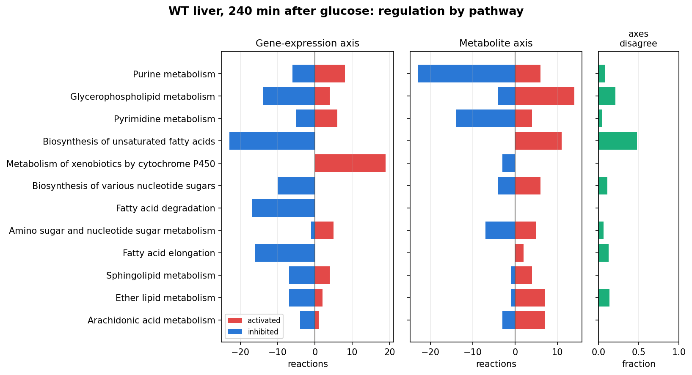

   Lean liver, 240 minutes: regulated reactions per KEGG pathway. Left, the
   enzyme axis; middle, the metabolite axis (red speeds reactions up, blue slows
   them down); right, the fraction where the two disagree.

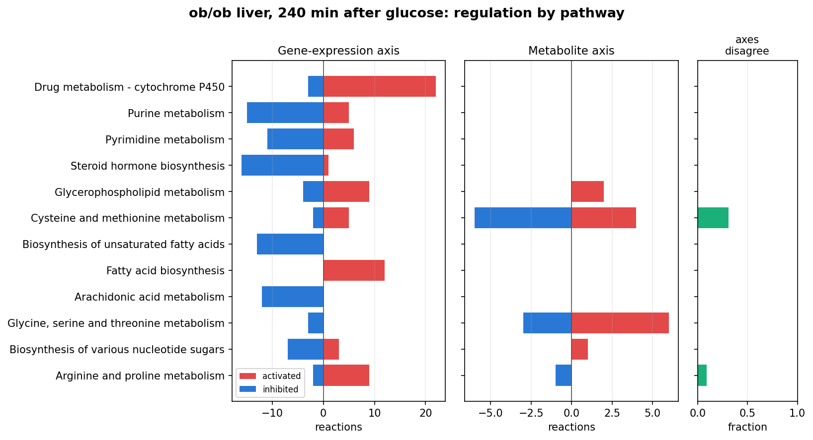

   Obese liver, the same contrast: the metabolite axis has almost disappeared.

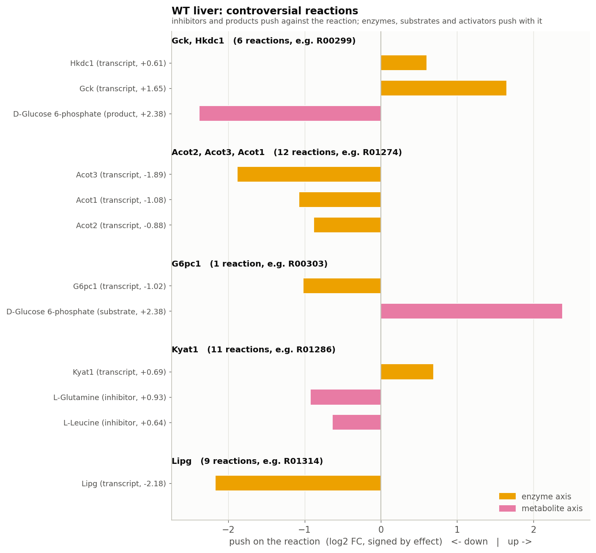

   Lean liver: the controversial reactions, grouped by enzyme. Each bar is one
   measured molecule's push on the reaction; yellow is the enzyme axis (here,
   transcripts only), pink the metabolite axis.

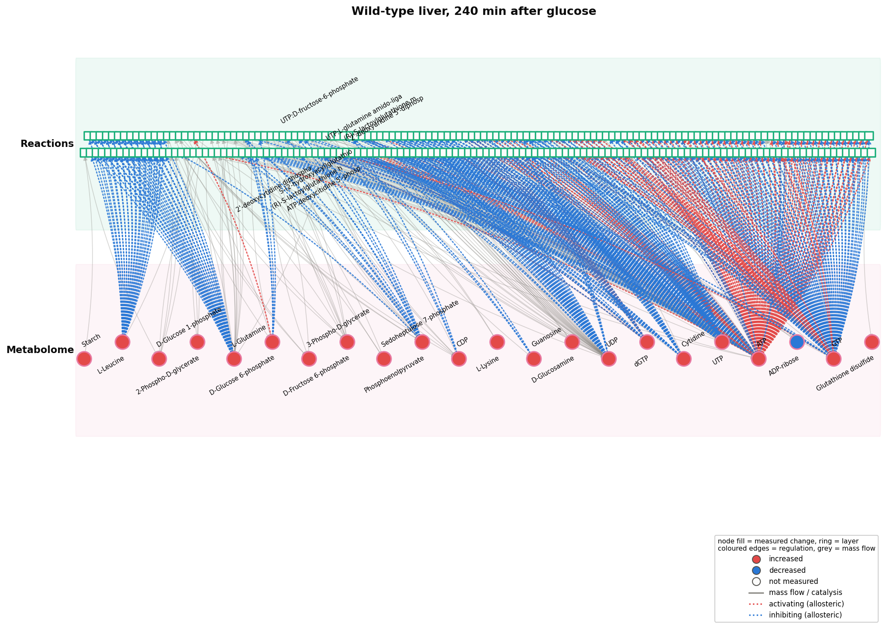

   Wild-type liver, 240 minutes after glucose.

.. figure:: figures/liver_timecourse/network_obob.png
   :width: 100%

   Obese liver, the same contrast, on the same network.

The two genotypes as networks
-----------------------------

Comparing the two responses edge type by edge type shows the loss more
clearly than any proportion:

.. list-table::
   :header-rows: 1
   :widths: 30 18 18 18 18

   * - Relationship
     - WT
     - ob/ob
     - Shared
     - Lost in ob/ob
   * - allosteric_inhibition
     - 346
     - 0
     - 0
     - 346
   * - allosteric_activation
     - 144
     - 0
     - 0
     - 144
   * - substrate
     - 109
     - 1
     - 1
     - 108
   * - product
     - 70
     - 1
     - 1
     - 69

.. figure:: figures/liver_timecourse/genotypes_compared.png
   :width: 100%

   Relationships kept, lost and reversed between the genotypes.

**The response of obese liver contains no allosteric edge at all**, where lean
liver has 490. The two responses share no edges (Jaccard index 0.00). A
comparison by molecule counts would report 844 regulated reactions against
1,202 and miss that allosteric regulation has disappeared entirely.

Do the changed metabolites regulate anything?
---------------------------------------------

In lean liver 14 of 26 changed metabolites are known regulators of an enzyme,
against 49 % of all measured metabolites (q = 0.54); in obese liver 3 of 8
(q = 0.85). Neither is enriched. The individual regulators are still worth
following up.

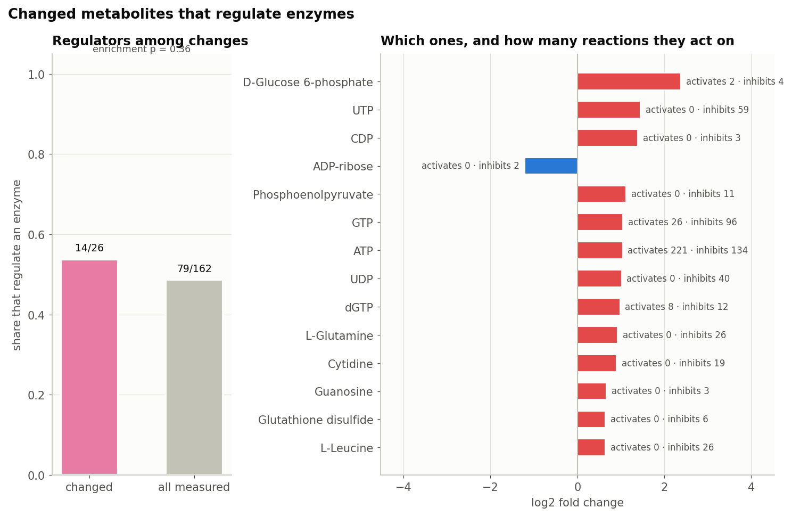

   Wild-type liver: the share that regulate an enzyme, against the background,
   with the regulators named.

Saturation, and the currency metabolites
----------------------------------------

A metabolite can only regulate an enzyme if its concentration is in the range
where the enzyme responds to it. Table S13 of the paper gives measured affinity
constants (Km and Ki) for ATP and NADP+, and a *saturation index* per genotype:
how close each enzyme is to saturation by that metabolite. An index near 1 means
the enzyme is saturated, so a further rise in the metabolite has no effect.

ATP and NADP+ are *currency metabolites*, which TransNet leaves out of the
metabolite axis by default because they take part in hundreds of reactions. The
saturation index tests that choice. Across 93 enzyme-metabolite pairs, the mean
ATP saturation is **0.71 in lean liver and 0.87 in obese liver** by Km, and
0.17 against 0.42 by Ki; NADP+ is unchanged at 0.82. 87 of the regulated
reactions have a measured index, and the largest shifts, about +0.34, are all
ATP-using kinases and ligases.

.. figure:: figures/liver_timecourse/saturation.png
   :width: 70%

   Every enzyme-metabolite pair, against the diagonal. 81 of 93 sit above it.

Obese liver is therefore *closer* to ATP saturation, where a further change in
ATP has less effect on reaction rates. The shift is systematic: only 12 of the
93 pairs move the other way. On these data, leaving ATP out of the metabolite
axis is supported by measurement, not only by convention.

Transcription factors, against a published inference
----------------------------------------------------

Elsewhere in this documentation there is nothing to check the
transcription-factor ranking against. Here the authors inferred factors from
the same transcriptome by a different method, motif enrichment in the promoters
of gene clusters, so the two inferences can be compared.

Ten of 708 testable factors are implicated in wild-type liver at q <= 0.05, nine
in obese liver.

.. list-table::
   :header-rows: 1
   :widths: 40 20 40

   * - Factor
     - Responsive targets
     - q
   * - Jarid2
     - 172 of 1,101
     - 7e-21
   * - Suz12
     - 146 of 930
     - 1e-17
   * - Cbx7
     - 136 of 851
     - 3e-17
   * - Rnf2
     - 216 of 1,764
     - 4e-14
   * - Mtf2
     - 100 of 642
     - 1e-11
   * - Eed
     - 75 of 440
     - 2e-10

All the top hits are Polycomb components: Jarid2, Suz12, Eed, Ezh2 and Mtf2
belong to PRC2, and Cbx7, Rnf2, Pcgf2, Bmi1 and Phc1 to PRC1. Polycomb complexes
bind thousands of promoters, so any large set of changed genes is enriched for
their targets, whatever the biology.

**The two inferences do not agree on a single factor.** Fourteen factors can be
tested in both analyses. The authors find all fourteen enriched; this analysis
implicates none of them, and implicates ten factors they do not.

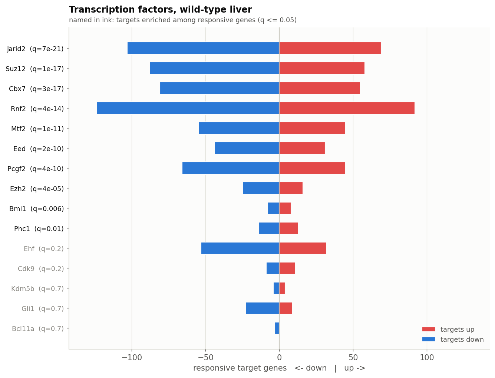

   Transcription factors behind the changed genes in lean liver. Factors that
   pass correction are labelled in black, the rest in grey.

This is one of the most useful results on this page. A test of ChIP-Atlas
target sets and a test of promoter motifs, run on the same data, select
completely different factors. Neither is shown to be wrong, but a
transcription-factor ranking from either method should be treated as a list of
factors to check, not as an answer.

Timing, against the authors' own half-response times
----------------------------------------------------

The other studies compute half-response times with TransNet. This supplement
provides the authors' own, per genotype and for both layers.

.. list-table::
   :header-rows: 1
   :widths: 18 24 20 20

   * - Genotype
     - Layer
     - With a t-half
     - Median (min)
   * - WT
     - Metabolome
     - 64
     - 13.2
   * -
     - Transcriptome
     - 1,255
     - 26.8
   * - ob/ob
     - Metabolome
     - 46
     - 14.7
   * -
     - Transcriptome
     - 2,511
     - 15.9

The order of the layers matches the paper: in lean liver the metabolome
responds at a median of 13 minutes and the transcriptome at 27. In obese liver
the transcriptome speeds up to 16 minutes while the metabolome stays at about
the same time, the same shift towards gene expression that the axis counts show.

:ref:`Morita et al. <ref-morita2025>` report that in healthy liver the
best-connected molecules respond first. With the authors' half-response times
and this network's connections, there is no association in either genotype or
layer (:math:`\rho` between −0.16 and 0.00, p ≥ 0.09).

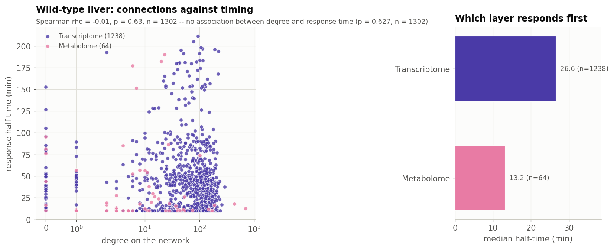

   Lean liver: number of connections against the authors' half-response time.

What does not work on this data
-------------------------------

* **The convergence test cannot run.** It counts reactions where a changed
  *protein* meets a changed metabolite, and this study has no proteome, so it
  finds 0 by construction. The function warns when this happens, because this
  zero is not a measurement.
* **Signed paths reach no changed metabolite.** 5,788 paths are traced in lean
  liver and 1,388 in obese liver, but none ends at a metabolite whose change
  could check the prediction; the paths make predictions that the measured
  metabolome does not cover. Propagation does reach changed metabolites, and
  predicts 8 of 22 correctly in lean liver and 2 of 6 in obese liver, no better
  than chance.
* **No molecule holds the response together**, for the same reason as the
  convergence test: without an enzyme layer, the responsive network has no
  chains to cut.
* **The cross-layer hubs are currency metabolites.** ATP, GTP, UTP and UDP lead
  the lean-liver ranking. In obese liver, where the allosteric edges are gone,
  fructose 6-phosphate and glucose 6-phosphate lead instead.
* **Regulatory motifs are almost absent**: one instance of product inhibition in
  lean liver and two in obese liver.

.. figure:: figures/liver_timecourse/convergence_null.png
   :width: 70%

   The convergence test cannot run: with no proteome, no enzyme is measured as
   changed, so no reaction can converge.

.. figure:: figures/liver_timecourse/regulatory_paths.png
   :width: 100%

   Lean liver: what the paths predict, with no measured metabolite to check it
   against.

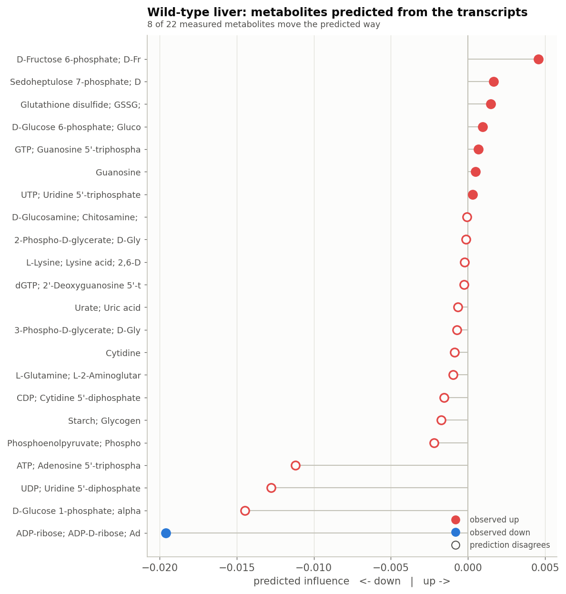

   Lean liver: metabolite directions predicted by propagation from the changed
   transcripts, against the measurement.

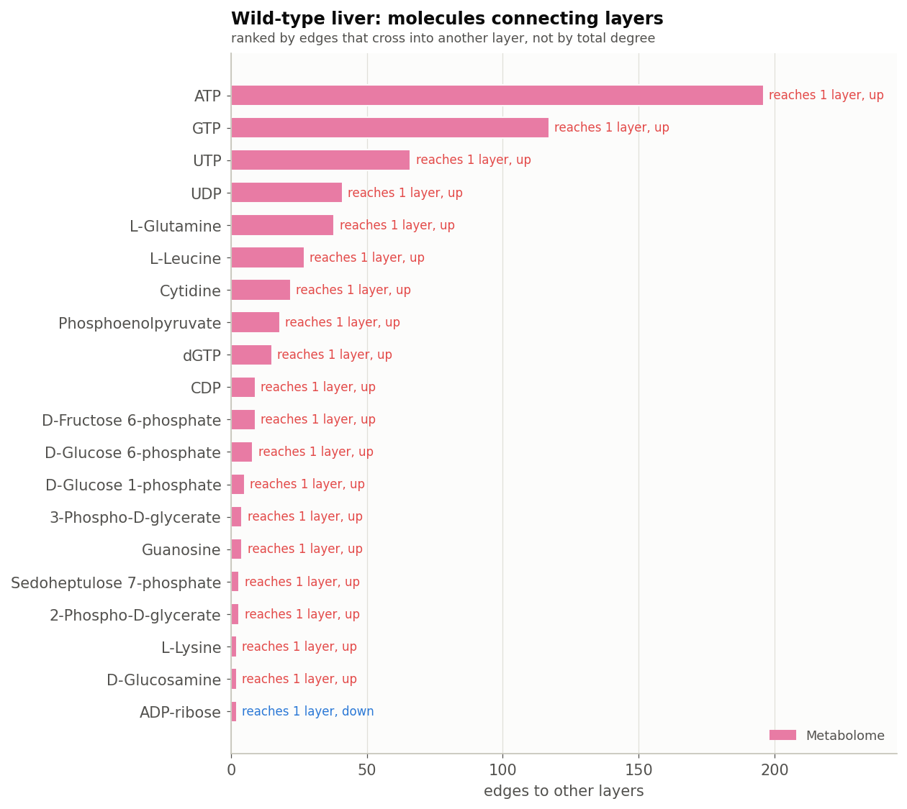

   Lean liver: the molecules with the most connections to other layers are
   currency metabolites.

.. figure:: figures/liver_timecourse/regulatory_motifs.png
   :width: 60%

The published claims, checked
-----------------------------

.. list-table::
   :header-rows: 1
   :widths: 44 16 40

   * - Claim
     - Verdict
     - This analysis
   * - Healthy hepatic glucose responses rely on regulation by metabolites
     - reproduced
     - 34% of regulated reactions in WT carry a changed metabolite, 490
       allosteric edges in the response
   * - In ob/ob liver, regulation by metabolites is lost
     - reproduced
     - 10% against 34%, and not one allosteric edge in the obese response
   * - ob/ob glucose responses depend instead on slow gene expression
     - reproduced
     - 91% of obese regulated reactions carry a changed transcript against 75%
       in WT, over 14,292 genes, with 552 responding against 425

All three are reproduced. On the 19-gene panel of :doc:`obese_liver_panel`,
two of them were reproduced only weakly and the third could not be tested at
all: the panel was too small to test them, not the claims wrong.

.. seealso::

   :doc:`obese_liver_panel` analyses the Uematsu panel from the same laboratory,
   and :doc:`motrpac_study` runs the catalogue across six tissues with
   phosphoproteomics.
