.. _motrpac-study:

MoTrPAC: six tissues, one network
=================================

The MoTrPAC endurance-training study measured transcriptome, proteome and
metabolome across rat tissues after 1, 2, 4 and 8 weeks of treadmill training.
One shared interactome carries six different responses, so the tissues are
directly comparable.

.. code-block:: bash

    # once: the rat network, alongside mouse, human, yeast and E. coli
    python maintenance/build_networks.py --organisms rat --brenda

    python notebooks/studies/motrpac_rat.py

Every number and figure below comes from that notebook; rerun it and
``python maintenance/refresh_doc_figures.py`` to bring this page up to date.

.. tip::

   This page is the summary. :doc:`The full notebook <studies/motrpac_rat>` runs
   every analysis in the catalogue on this data, with all of its tables and
   figures: the factor analyses read through the network, the regulatory motifs,
   the structural vulnerability and the convergence null.

The design, and where direction comes from
------------------------------------------

MoTrPAC distributes a time-course ANOVA, which says *that* a molecule responded
and not which way. The analysis therefore computes its own contrast from the
normalised data: each training timepoint against its sedentary controls, as the
mean of the within-sex differences, with a Welch test on sex-centred values and
Benjamini-Hochberg correction. ``--contrast`` selects the timepoint; 8 weeks is
the default and is what this page reports.

The rat network is the organism-wide one in ``data/rat/latest``, the same
artefact as for every other organism, built from KEGG, UniProt, STRING,
ChIP-Atlas (``rn6``) and BRENDA. Each tissue gets its own copy with its own
response mapped on: the wiring is shared, the regulation is not.

The rat network holds 74,363 molecules and 258,015 typed relationships, of
which **55% cross between layers**. Mapping is uneven, and that limit runs
through everything below: of the features each
tissue measures, about 88% of transcripts and 35% of proteins reach the
network, but only ~18% of metabolites.

Modification sites
------------------

MoTrPAC measures three post-translational modifications beside protein
abundance. Each says something different about an enzyme whose amount did or did
not change: phosphorylation its activity state, in every tissue here;
ubiquitination whether it is being degraded; acetylation the mitochondrial
enzyme regulation exercise is expected to act on. Acetylation and ubiquitination
were measured in heart and liver only.

.. list-table::
   :header-rows: 1
   :widths: 16 14 16 18 18 18

   * - Assay
     - Tissue
     - Sites
     - Proteins
     - Changed sites
     - Changed proteins
   * - PHOSPHO
     - SKM_GN
     - 29,651
     - 4,313
     - 892
     - 508
   * -
     - HEART
     - 40,208
     - 7,860
     - 490
     - 298
   * -
     - LIVER
     - 43,567
     - 8,529
     - 489
     - 383
   * -
     - KIDNEY
     - 30,144
     - 6,223
     - 24
     - 21
   * -
     - LUNG
     - 47,661
     - 6,939
     - 18
     - 15
   * -
     - CORTEX
     - 46,502
     - 6,997
     - 0
     - 0
   * - ACETYL
     - LIVER
     - 9,750
     - 2,426
     - 926
     - 431
   * -
     - HEART
     - 5,213
     - 1,382
     - 221
     - 134
   * - UBIQ
     - HEART
     - 6,870
     - 1,859
     - 43
     - 25
   * -
     - LIVER
     - 9,127
     - 2,561
     - 9
     - 9

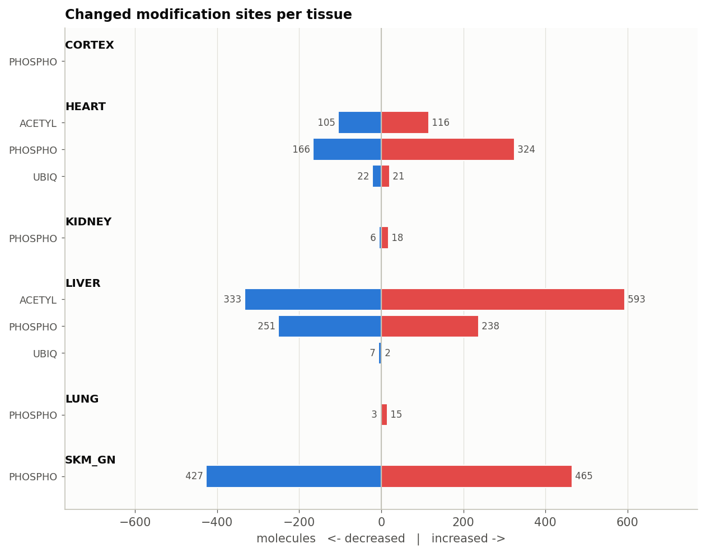

   Changed modification sites per tissue. Bars to the right count sites that
   rose, to the left sites that fell.

The unit is a site, not a protein. Each one becomes its own node with an edge
into the protein it sits on, and several sites on one protein stay separate,
because they can move in opposite directions. The edge is unsigned: whether more
phosphorylation at a given site raises or lowers catalytic activity is
site-specific and not recorded, so the direction of the site and its effect on
the reaction are reported separately. Between 7,000 and 13,000 sites per tissue
reach a protein in the network.

Enzyme amount against enzyme modification
-----------------------------------------

The reactions worth separating out are those where the enzyme's amount held
steady while its modification state moved. An abundance-only reading calls them
unregulated.

.. list-table::
   :header-rows: 1
   :widths: 18 26 28 28

   * - Tissue
     - Reactions with a changed site
     - Amount steady, site moved
     - Sites disagree
   * - HEART
     - 235
     - 114
     - 2
   * - SKM_GN
     - 138
     - 69
     - 3
   * - LIVER
     - 89
     - 53
     - 2
   * - KIDNEY
     - 3
     - 3
     - 0
   * - CORTEX / LUNG
     - 0
     - 0
     - 0

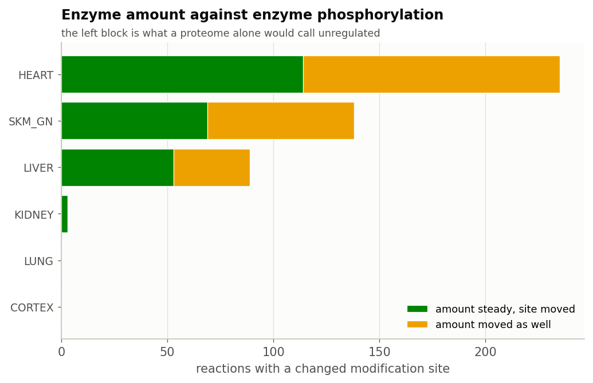

   The left block is what a proteome alone would call unregulated.

In trained muscle these are the adenylate kinases and the nucleoside-diphosphate
transfer reactions, and both isocitrate dehydrogenase steps of the TCA cycle.
Pyruvate kinase carries a changed site too, alongside the metabolite axis
already reported for it.

``phospho_axis_effect`` is 0 throughout, because the edges are unsigned. The
analysis reports that these enzymes are phospho-regulated and which way the sites
moved, not what that does to catalysis. Signing them needs site-level annotation
the network does not have.

Which axis regulates each reaction
----------------------------------

.. list-table::
   :header-rows: 1
   :widths: 14 14 16 18 14 24

   * - Tissue
     - Regulated
     - Enzyme axis only
     - Metabolite axis only
     - Both
     - Controversial
   * - CORTEX
     - 46
     - 46
     - 0
     - 0
     - 0
   * - HEART
     - 1,237
     - 562
     - 488
     - 187
     - 75 (16 enzymes)
   * - KIDNEY
     - 598
     - 424
     - 160
     - 14
     - 1
   * - LIVER
     - 1,052
     - 486
     - 474
     - 92
     - 19 (5 enzymes)
   * - LUNG
     - 292
     - 290
     - 2
     - 0
     - 0
   * - SKM_GN
     - 1,190
     - 519
     - 585
     - 86
     - 52 (18 enzymes)

The tissues differ in kind as well as in amount. Heart, liver and
gastrocnemius regulate a large share of their reactions through metabolites;
cortex and lung, whose metabolomes barely move, are enzyme-driven by default.
Within the enzyme axis, the split between transcriptional and
post-transcriptional control is just as uneven: in heart 325 of 749
enzyme-axis reactions have the transcript moving too, in liver only 35 of 494.

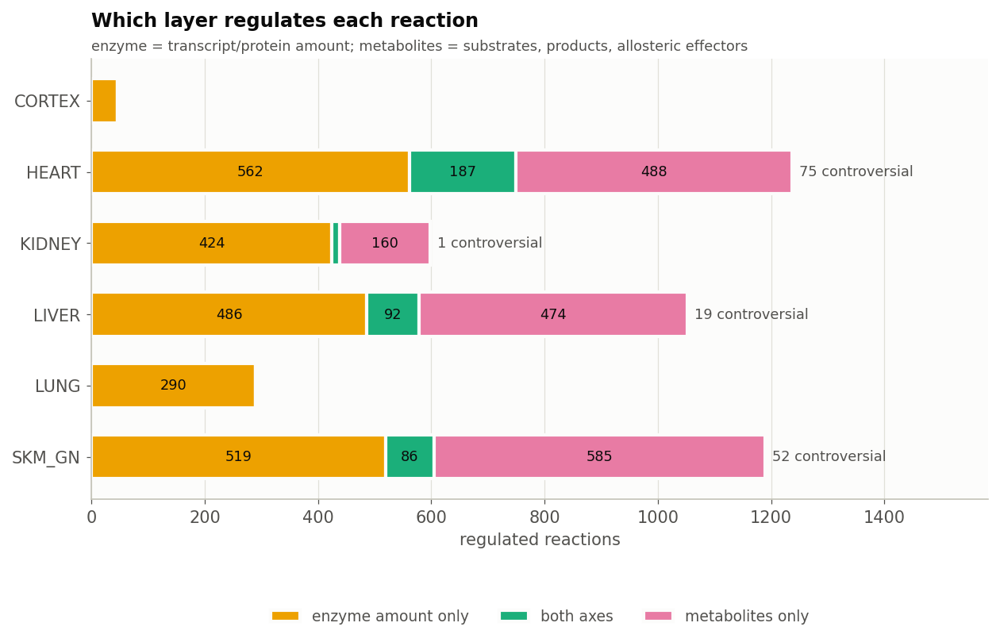

Aggregated over the trained muscle's 1,190 regulated reactions, 51% carry a
changed enzyme and 56% a changed metabolite, so the two axes overlap rather
than divide the reactions between them. 4.4% are controversial.

**Do the changed metabolites regulate anything?** In no tissue are they
enriched for regulators. In trained muscle 13 of 19 changed metabolites act on
an enzyme, but so do 66% of all measured metabolites (q = 0.75); heart 8 of 15
against 64% (q = 0.89); liver 8 of 16 against 62% (q = 0.91). With BRENDA
included, most measured metabolites are an annotated effector of something, so
this test has little room to show enrichment. The named regulators are worth
following individually; the set as a whole shows nothing.

The trans-omic view of the trained muscle
-----------------------------------------

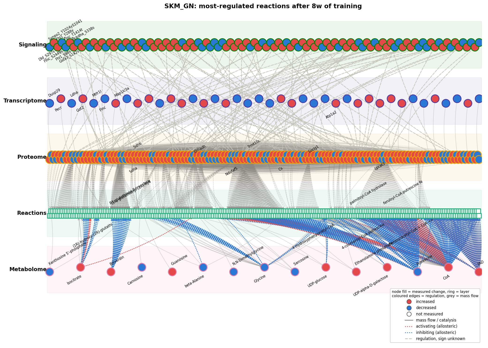

   Gastrocnemius after 8 weeks: the TCA segment (Idh1/Idh2, Got1/Got2, citrate,
   isocitrate, succinate, fumarate, malate), the adenylate kinases, and the
   kynurenine aminotransferases Kyat1/Kyat3, the enzymes behind the
   exercise-induced kynurenine-to-kynurenate shift. Selected by where regulation
   converges rather than by degree. The Signaling row carries the phosphosites
   measured on the enzymes below it.

Is each protein change transcriptional?
---------------------------------------

.. list-table::
   :header-rows: 1
   :widths: 16 16 16 18 18 16

   * - Tissue
     - Concordant
     - Protein only
     - Against transcript
     - Beyond transcript
     - :math:`\rho`
   * - CORTEX
     - 0
     - 18
     - 0
     - 3
     - 0.06
   * - HEART
     - 36
     - 281
     - 7
     - 70
     - 0.18
   * - KIDNEY
     - 1
     - 85
     - 1
     - 21
     - 0.16
   * - LIVER
     - 2
     - 390
     - 0
     - 62
     - 0.18
   * - LUNG
     - 0
     - 46
     - 0
     - 6
     - 0.25
   * - SKM_GN
     - 30
     - 291
     - 6
     - 108
     - 0.37

"Protein only" is partly a power artefact, since in liver only 29 transcripts
passed the threshold at all. The column to read is **beyond transcript**: a direct test of protein change minus transcript change with
standard errors, which needs no threshold. It holds up in every tissue, most
strongly in trained muscle (108 proteins). The caveat travels with the number:
it assumes the two platforms report fold changes on comparable scales, and
isobaric ratio compression makes that conservative.

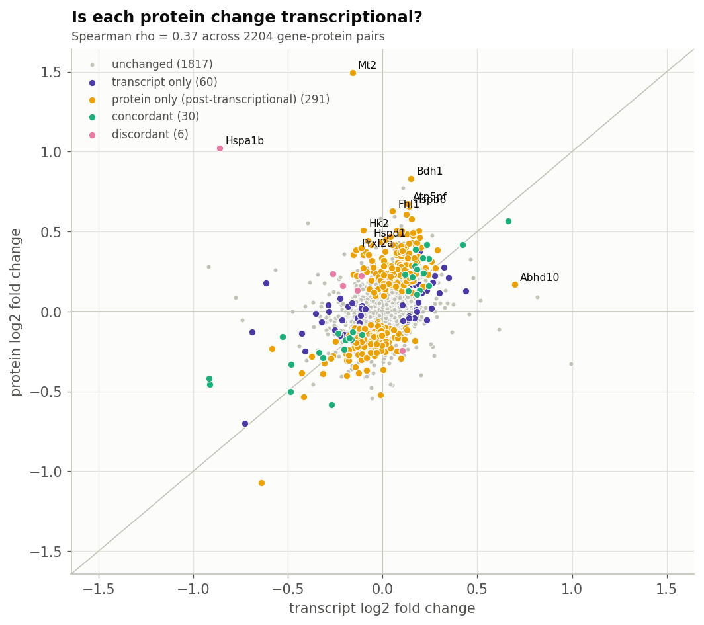

Does ubiquitination explain the proteins that changed alone?
------------------------------------------------------------

"Protein changed, transcript did not" is the largest class in every tissue, and
the usual explanations are translation rate and degradation. Ubiquitination is
the one of those MoTrPAC measures, so the question can be asked rather than left
open.

It does not explain the class. In heart, 4.6% of the protein-only proteins carry
a changed ubiquitination site, against 5.6% of the concordant ones; in liver the
figure is 0% in both. With 43 changed ubiquitin sites in heart and 9 in liver
there is nothing here to account for several hundred proteins. The reading is
that this assay does not explain the protein-only class at eight weeks, not that
degradation is uninvolved.

Acetylation, against the mitochondrial claim
--------------------------------------------

Mitochondrial enzyme activity is regulated by acetylation, and heart and liver
are the two tissues where it was measured. Liver changes 926 acetylation sites
on 431 proteins, 593 up and 333 down; heart changes 221 sites on 134 proteins,
116 up and 105 down. Neither is the one-directional increase a simple reading of
"increased mitochondrial biogenesis" would predict, and the split is close to
even in both.

Timing, hubs and the comparison between tissues
-----------------------------------------------

**Response time.** Only gastrocnemius shows an association between connectivity
and response time (Spearman :math:`\rho` = +0.17, p = 3.3e-08), and it runs the
*opposite* way to :ref:`Morita et al. <ref-morita2025>`: the best-connected molecules respond last.
In every tissue the layers order as metabolome, then transcriptome, then
proteome.

**Hubs.** The molecules linking most layers within a response are metabolites
where the metabolome moved (CoA and putrescine in muscle, NADPH and NADP+ in
liver, ATP and CoA in heart) and proteins where it did not (glutathione
transferases in kidney). Five molecules are hubs in more than one tissue.

**Tissues compared as networks.** Sharing by typed regulatory edge is low
throughout (edge Jaccard ≤ 0.33): heart and gastrocnemius share 0.16, cortex
and lung 0.33, and that last pair share it by both barely responding. **30
molecules respond in opposite directions in different tissues**, among them
fructose-1,6-bisphosphatase and hypotaurine (heart down, liver up). A shared
molecule list would report these as "responsive in both".

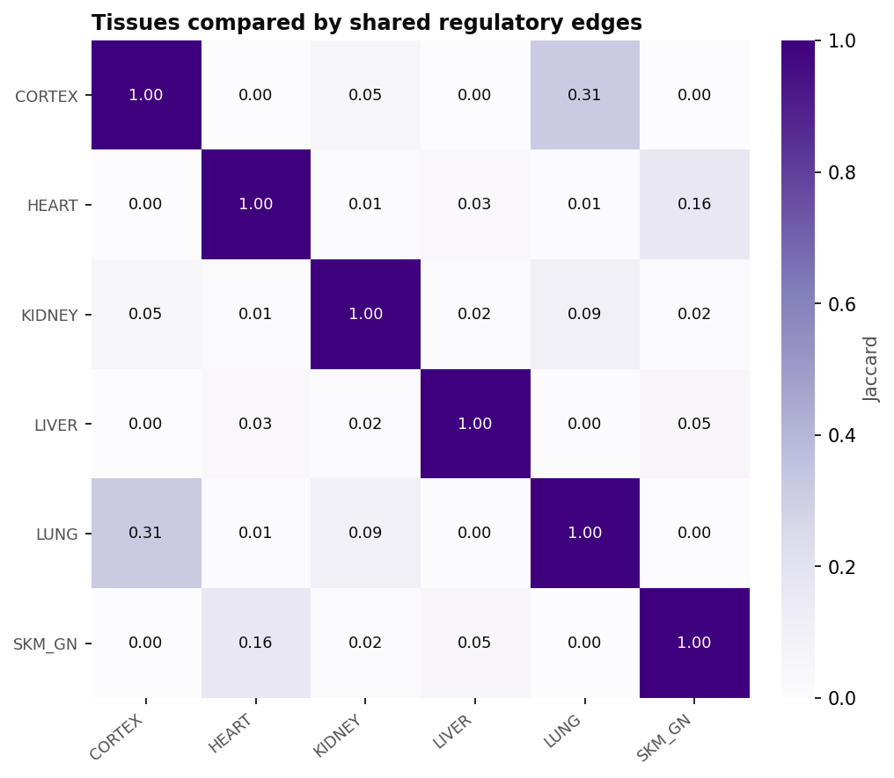

Signed paths, and propagation from the upper layers
---------------------------------------------------

Two ways of asking whether the layers above the metabolome predict it: trace
signed paths to each changed metabolite, or propagate the changed genes and
proteins forward along signed edges and read off what arrives.

.. list-table::
   :header-rows: 1
   :widths: 16 14 22 22 26

   * - Tissue
     - Paths traced
     - Metabolites tested
     - Predicted by paths
     - Predicted by propagation
   * - HEART
     - 85
     - 5
     - 1
     - 6 of 10 reached
   * - KIDNEY
     - 111
     - 2
     - 1
     - 1 of 2
   * - LIVER
     - 18
     - 4
     - 3
     - 5 of 10
   * - SKM_GN
     - 248
     - 13
     - 9
     - 15 of 18
   * - CORTEX / LUNG
     - 1,412 / 1
     - 0 / 1
     - 0 / 1
     - 0 / 1

   Trained muscle: each path's prediction against the measurement.

Neither beats chance in any tissue once the metabolites are counted once each
rather than once per path (trained muscle, the best case: 9 of 13, p = 0.27).
Metabolome coverage is the binding constraint: about 220 metabolites on the
network per tissue, of which one or two dozen change.

The wiring itself
-----------------

Three readings of the network rather than of the data through it, and the one
place where six responses on **one** interactome can be compared directly.

.. list-table::
   :header-rows: 1
   :widths: 14 18 22 22 24

   * - Tissue
     - Product inhibition
     - Convergent reactions
     - Expected by chance
     - Holds the response together
   * - HEART
     - 2
     - 366
     - 9.9 (z = +15.1)
     - Eef2, Prkn
   * - SKM_GN
     - 6
     - 341
     - 17.6 (z = +7.6)
     - Mrps7, Etfdh
   * - LIVER
     - 0
     - 226
     - 14.1 (z = +6.6)
     - Cycs, Mrps26
   * - KIDNEY
     - 6
     - 14
     - 0.1 (z = +43.4)
     - Got1, Maob
   * - CORTEX / LUNG
     - 0
     - 0
     - 0 / 3.1
     - --

**Motifs.** Product inhibition, where a reaction is regulated by the metabolite
it makes, is found from the wiring rather than assumed: six instances in trained
muscle and in kidney, two in heart. These are the reactions that can slow while their
enzyme rises. No feed-forward motif survives the requirement that the
transcription factor itself responded, which is a statement about ChIP-Atlas's
rat coverage rather than about exercise.

**Convergence.** Every responding tissue converges on shared reactions far
more than chance allows: holding the network and the number of changed
molecules per layer fixed and shuffling *which* molecules changed, heart
expects 10 convergent reactions and has 366. This is the claim the whole
catalogue rests on, tested rather than assumed.

**Vulnerability.** The molecules whose removal splits the response into
disconnected pieces differ by tissue: the translation elongation factor Eef2
and the ubiquitin ligase Prkn in heart, mitochondrial ribosomal proteins and
the electron-transfer flavoprotein dehydrogenase Etfdh in muscle, cytochrome c
in liver. They are where one layer's response reaches another through a single
route.

Compared with the consortium's own analysis
-------------------------------------------

The consortium's paper (:ref:`MoTrPAC Study Group 2024 <ref-motrpac2024>`)
reports genome-wide, multi-tissue patterns; the network
reading agrees with three of them and takes the fourth down to individual
reactions.

.. list-table::
   :header-rows: 1
   :widths: 46 54

   * - MoTrPAC 2024
     - What the network reading shows
   * - 58% of 8-week training-regulated features are sex-differentiated
     - sex is inseparable from the training response here: every one of the
       six gastrocnemius factors mixes timepoint with sex, three of them with
       an interaction
   * - 22 genes are training-regulated in all six tissues, with the heat-shock
       response prominent
     - the molecules that are cross-layer hubs in more than one tissue are led
       by HSP90-alpha and HSPA1B
   * - 67% of training-regulated genes are tissue-specific
     - typed edge Jaccard between tissues is at most 0.33, and 30 molecules
       respond in *opposite* directions in different tissues, which a shared
       gene list reports as agreement
   * - Increased mitochondrial biogenesis in skeletal muscle, heart and liver
     - read enzyme by enzyme it holds in muscle and nowhere else: in
       gastrocnemius 12 of 12 responsive TCA enzymes and 5 of 7 OXPHOS
       subunits move *up*, while heart has 2 of 12 and liver 5 of 12. The
       consortium's enrichment score and the reaction-level reading diverge

"Mitochondrial biogenesis" in the paper is a statement about gene sets. The
network says which reactions were regulated and through which axis, and the two
readings disagree in heart and liver.

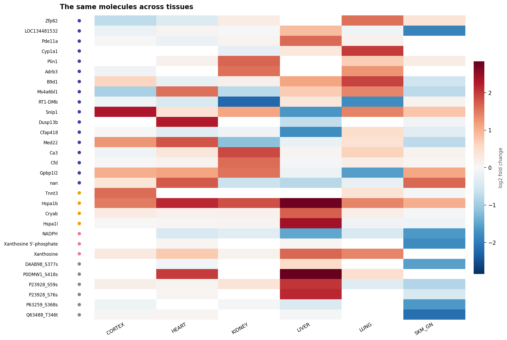

   The same molecules across tissues. The block structure is the tissue
   specificity the consortium quantifies genome-wide.

Factors, read through the network
---------------------------------

The same NMF factorisation any multi-omics toolbox would fit, but each factor
is then read *on the network* rather than only against the design.

**Are the layers from the same animals?** This is checked rather than assumed.
Correlating each gene's transcript with its protein across the 47 animals gives
a mean of 0.030 where the shuffled pairing gives 0.000 (p = 0.002 over 1,972
matched genes). The layers are paired, so a joint factorisation is valid.

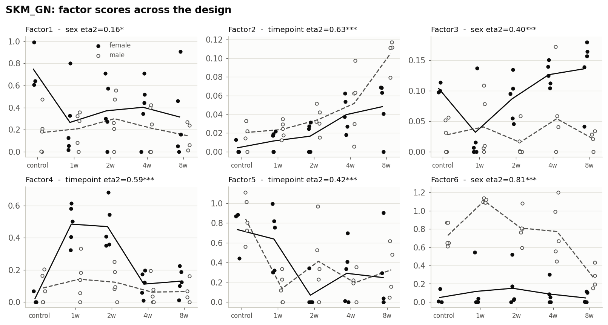

   Six factors across 47 animals, by timepoint and sex.

Every factor mixes timepoint with sex, and three carry an interaction. The
robustness check separates them by *what* they capture:

.. list-table::
   :header-rows: 1
   :widths: 12 20 22 22 24

   * - Factor
     - Strongest term
     - Verdict
     - Cross-layer overlap
     - Network coherence
   * - Factor1
     - sex
     - within-group
     - q = 0.012
     - 1.77x, q = 0.096
   * - Factor2
     - timepoint
     - between-group
     - q = 0.031
     - 1.21x, q = 0.31
   * - Factor3
     - sex
     - within-group
     - q = 0.050
     - 0.84x, n.s.
   * - Factor4
     - timepoint x sex
     - between-group
     - q = 0.019
     - 1.30x, q = 0.22
   * - Factor5
     - sex
     - within-group
     - q = 0.014
     - 1.44x, q = 0.14
   * - Factor6
     - sex (:math:`\eta^2` = 0.813)
     - between-group
     - q = 0.022
     - 1.09x, n.s.

Three readings, and what each one adds:

* **Cross-layer overlap** asks whether a factor's top features in one layer sit
  near its top features in another, against a layer-matched null. Every factor
  passes (q = 0.012-0.050): the factorisation is finding coordinated
  cross-layer structure, not six independent single-layer signals.
* **Network coherence** asks the stricter question: are a factor's top features
  connected to each other? No factor passes correction, 1.77x at best with
  q = 0.096. Coordinated across layers, but not a module.
* **The pairing verdict** separates factors that distinguish the design groups
  from those that vary within them. Factor6 is almost entirely sex
  (:math:`\eta^2` = 0.813). Sex is the largest source of structure in this
  cohort, which is the consortium's own headline seen from the other side.

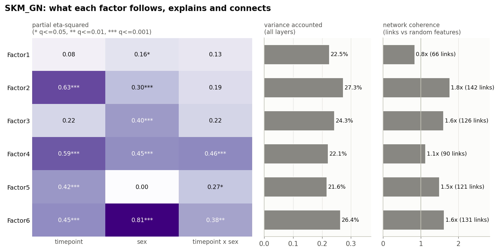

The network reading also says *where* a factor lives. Factor5's metabolite
loadings concentrate on trimethylamine N-oxide, hypotaurine, hippurate,
alpha-muricholate and glycocholate: microbial and bile-acid metabolites, a
gut-derived axis. It is legible because the loadings were read against named
network nodes rather than feature indices.

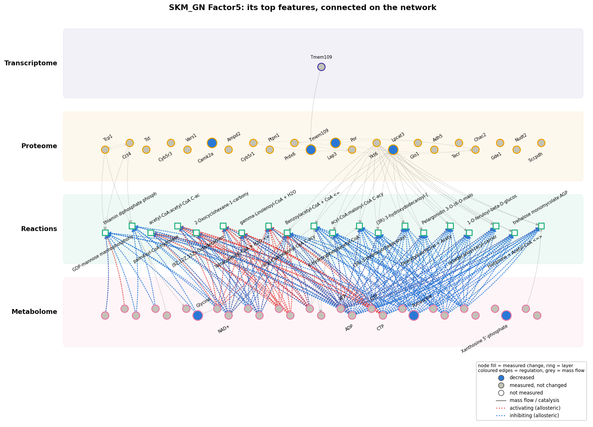

   Factor5's top loadings placed on the network.

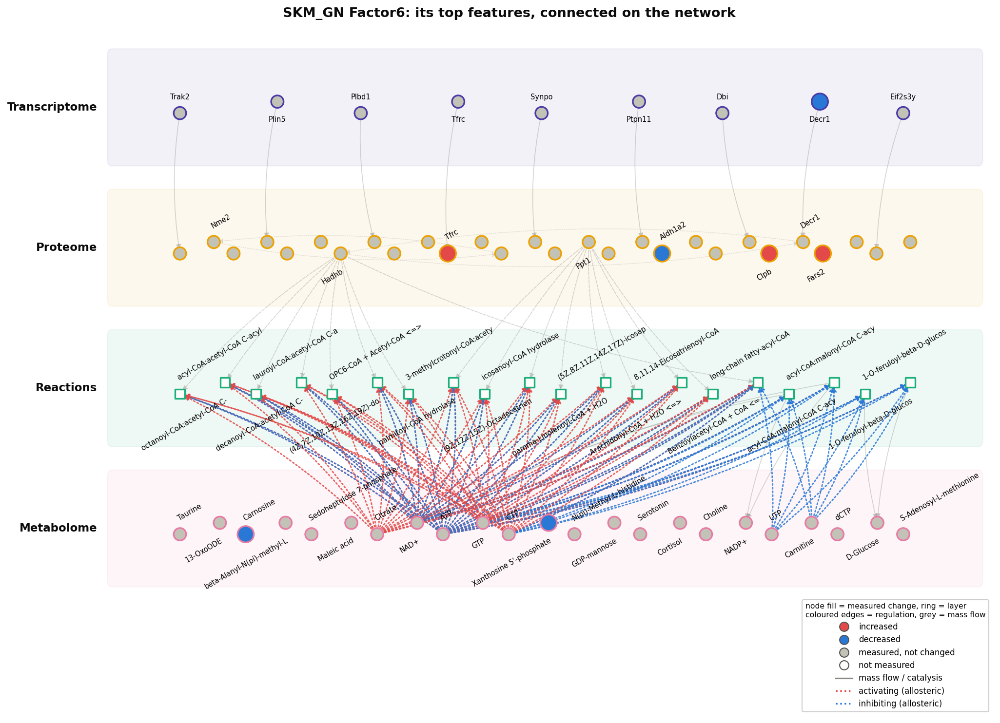

   Factor6, the sex factor, for contrast: a different neighbourhood entirely.

What does not work on this data
-------------------------------

* **Signed paths (**:ref:`signed regulatory paths <signed-paths>`\ **) beat chance in no tissue.** Muscle is
  the best at 9 of 13 metabolites (69%, p = 0.27). Scored per path rather than
  per molecule this looked overwhelming (p = 4e-17); it was one hub metabolite
  reached by dozens of paths sharing most of their steps. See :ref:`signed regulatory paths <signed-paths>`
  for the two rules that stop that.
* **Transcription-factor inference is limited by coverage**: only 32 factors
  are testable on the rat ``rn6`` ChIP-Atlas data. Two tissues implicate any --
  heart (Arnt and Mlxipl, both with targets up) and kidney (Arnt, Crtc2, Sp1,
  Sox10 among seven). Four tissues implicate none, which says more about
  ChIP-Atlas's rat coverage than about the biology.
* **Changed metabolites are not enriched for regulators** in any tissue
  (q ≥ 0.75 throughout) -- the numbers are above, under the regulation axes.
* **No feed-forward motif** survives requiring the transcription factor itself
  to have responded, and **cortex and lung show no convergence at all**: with
  46 and 292 regulated reactions and metabolomes that barely move, there is
  nothing for the cross-layer analyses to work on.

.. seealso::

   :doc:`brown_adipocytes` runs the same catalogue on a signed mouse time course,
   and :doc:`published_study` checks it against published conclusions.
