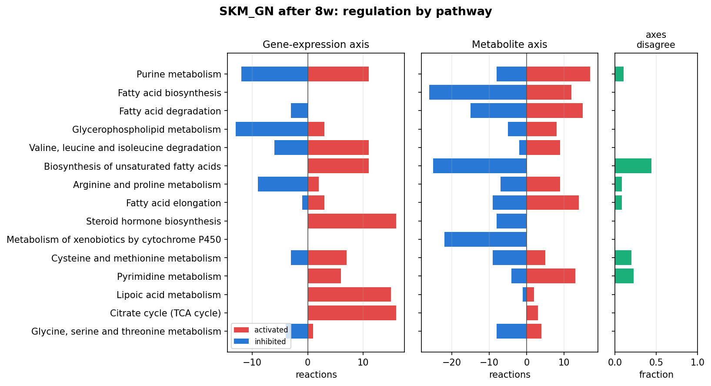
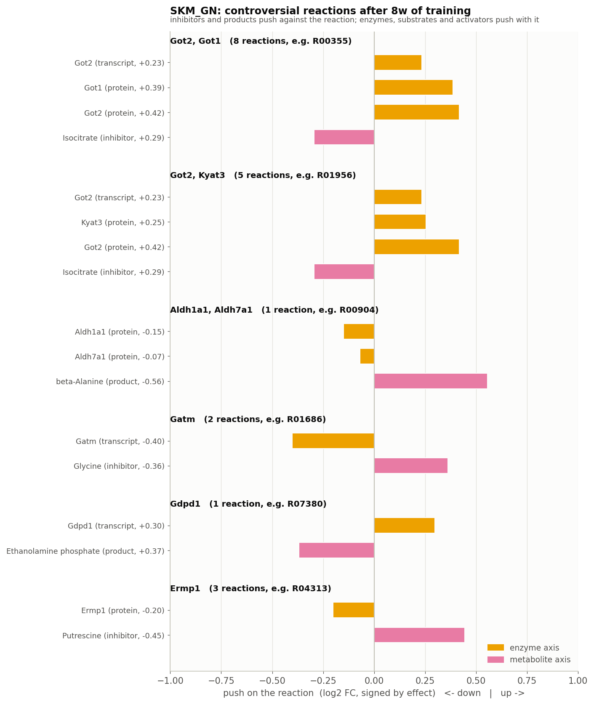
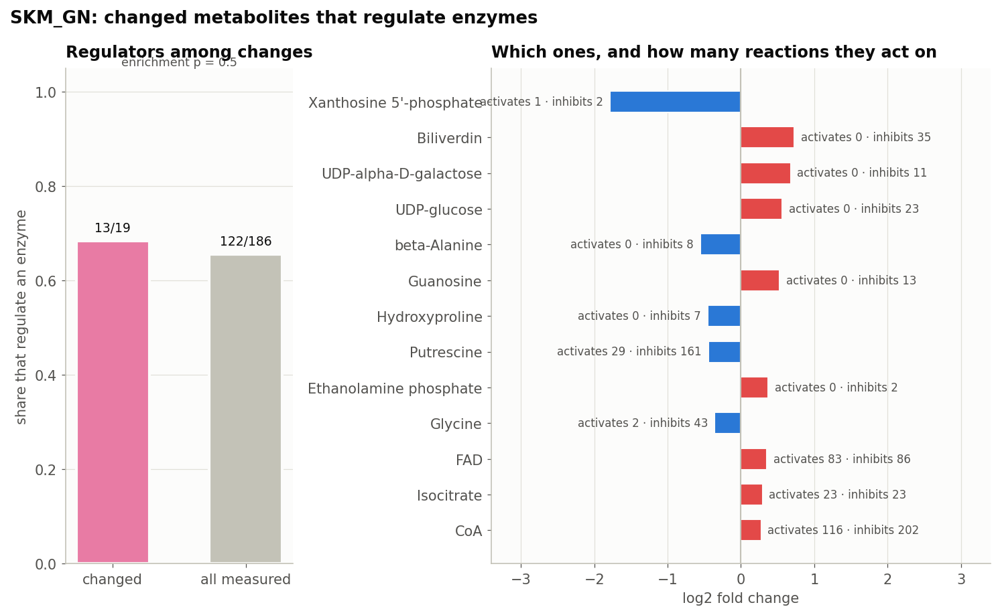
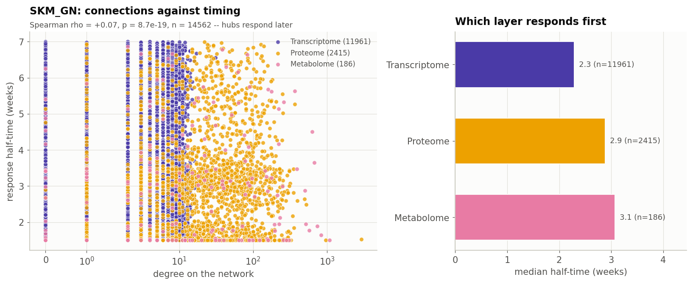
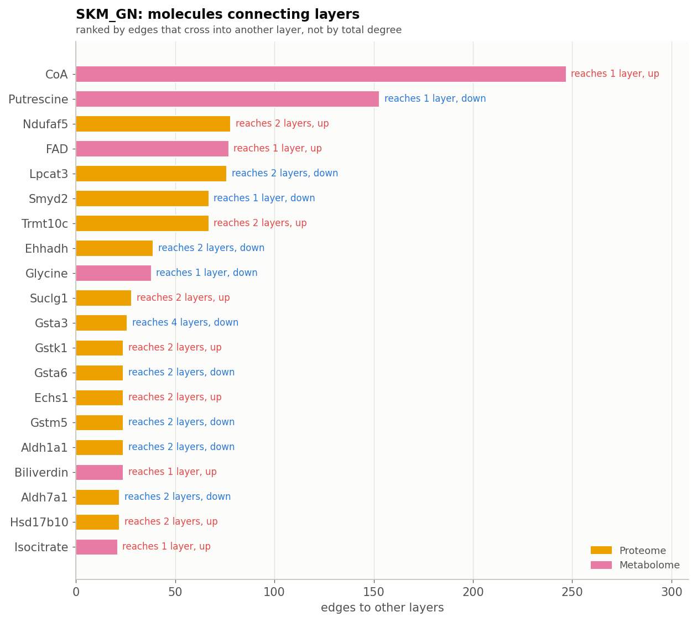
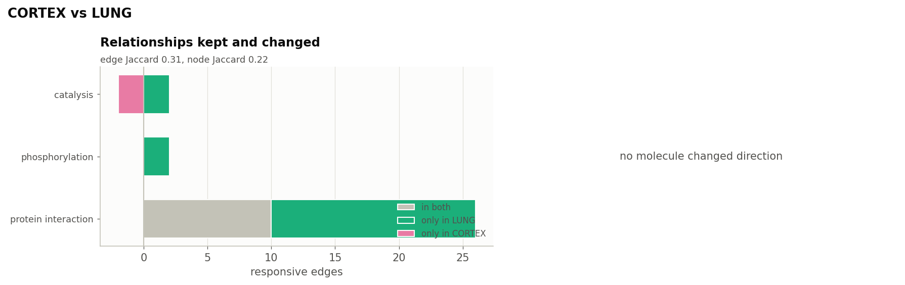
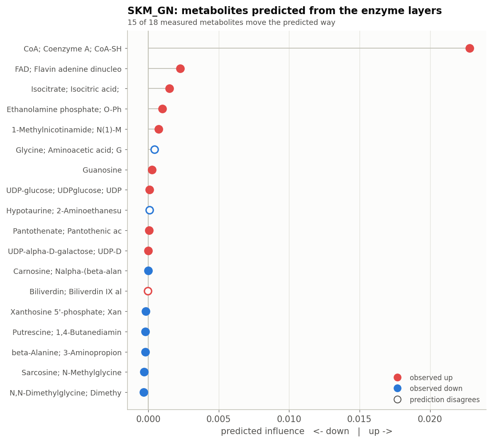
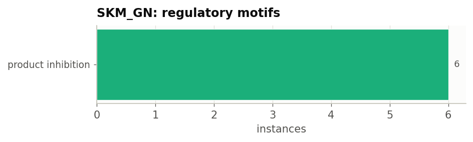
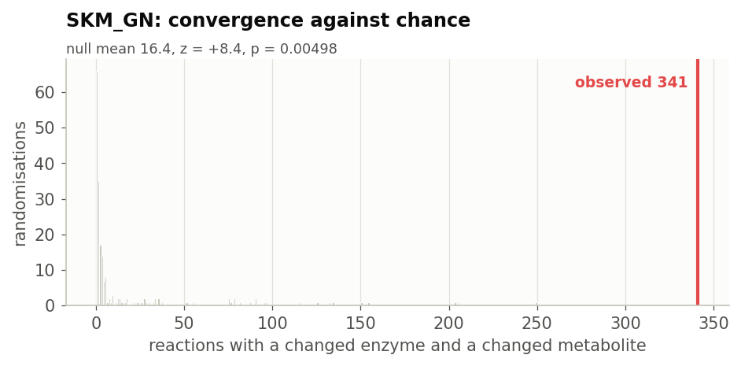
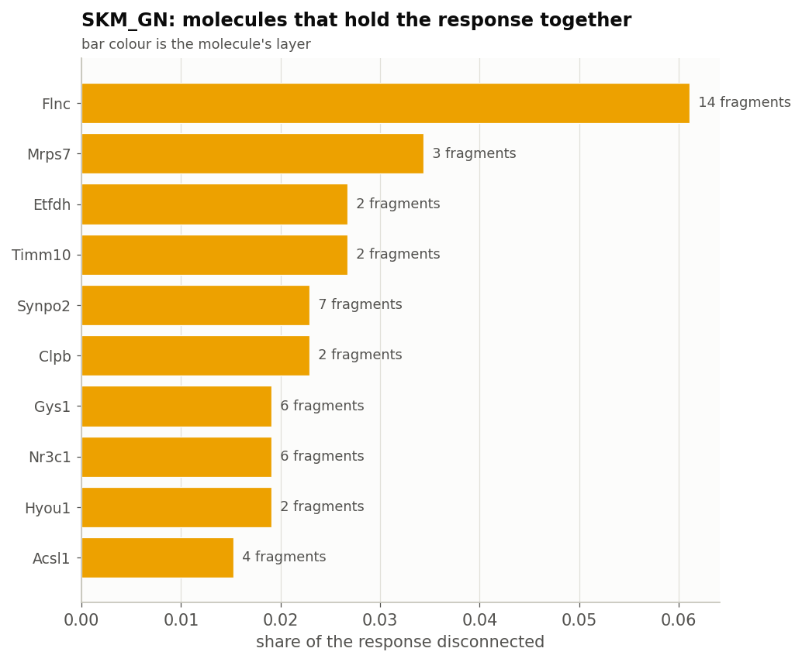

.. _motrpac-study:

MoTrPAC: endurance training in six rat tissues
==============================================

.. list-table::
   :widths: 22 78

   * - **Question**
     - Endurance training changes many tissues at once. Do they respond
       through the same regulatory mechanisms, and how much of the response
       lies in enzyme modification rather than enzyme amount?
   * - **System**
     - Rats trained on a treadmill for 1, 2, 4 and 8 weeks, against sedentary
       controls; gastrocnemius muscle, heart, liver, kidney, lung and cortex
   * - **Layers**
     - Transcriptome, proteome and metabolome in every tissue;
       phosphorylation sites in every tissue; acetylation and ubiquitination
       sites in heart and liver
   * - **Data**
     - :ref:`MoTrPAC Study Group 2024 <ref-motrpac2024>`, *Nature*
   * - **Network**
     - The organism-wide rat network, one copy per tissue
   * - **Notebook**
     - :doc:`studies/motrpac_rat`, with every table and figure

This page is the summary. Run the analysis with:

.. code-block:: bash

    # once: the rat network
    python maintenance/build_networks.py --organisms rat --brenda

    python notebooks/studies/motrpac_rat.py

Every number and figure below comes from that notebook. After a rerun,
``python maintenance/refresh_doc_figures.py`` copies the figures here.

The design, and where direction comes from
------------------------------------------

MoTrPAC distributes a time-course test (an ANOVA), which says *that* a molecule
responded but not in which direction. The analysis therefore computes its own contrast from the
normalised data: each training timepoint against its sedentary controls, as the
mean of the within-sex differences, with a Welch test on sex-centred values and
Benjamini-Hochberg correction. ``--contrast`` selects the timepoint; 8 weeks is
the default and is what this page reports.

The rat network is the organism-wide one in ``data/rat/latest``, the same
artefact as for every other organism, built from KEGG, UniProt, STRING,
ChIP-Atlas (``rn6``) and BRENDA. Each tissue is mapped onto its own copy: the
network is shared, the measured response is not.

The rat network holds 74,363 molecules and 258,015 edges, of which **55 %
connect two different layers**. Mapping is uneven, and that limit runs
through everything below: of the features each
tissue measures, about 88% of transcripts and 35% of proteins reach the
network, but only ~18% of metabolites.

Modification sites
------------------

Besides protein amounts, MoTrPAC measures three protein modifications, and each
says something different about an enzyme: phosphorylation often switches its
activity on or off; ubiquitination marks it for degradation; acetylation
regulates many mitochondrial enzymes, which training is expected to affect.
Phosphorylation was measured in every tissue here, acetylation and
ubiquitination in heart and liver only.

.. list-table::
   :header-rows: 1
   :widths: 16 14 16 18 18 18

   * - Assay
     - Tissue
     - Sites
     - Proteins
     - Changed sites
     - Changed proteins
   * - PHOSPHO
     - SKM_GN
     - 29,651
     - 4,313
     - 892
     - 508
   * -
     - HEART
     - 40,208
     - 7,860
     - 490
     - 298
   * -
     - LIVER
     - 43,567
     - 8,529
     - 489
     - 383
   * -
     - KIDNEY
     - 30,144
     - 6,223
     - 24
     - 21
   * -
     - LUNG
     - 47,661
     - 6,939
     - 18
     - 15
   * -
     - CORTEX
     - 46,502
     - 6,997
     - 0
     - 0
   * - ACETYL
     - LIVER
     - 9,750
     - 2,426
     - 926
     - 431
   * -
     - HEART
     - 5,213
     - 1,382
     - 221
     - 134
   * - UBIQ
     - HEART
     - 6,870
     - 1,859
     - 43
     - 25
   * -
     - LIVER
     - 9,127
     - 2,561
     - 9
     - 9

.. figure:: figures/motrpac/modification_sites.png
   :width: 100%

   Changed modification sites per tissue. Bars to the right count sites that
   rose, to the left sites that fell.

These assays measure sites, not proteins. Each site becomes its own node with an
edge to the protein it sits on, and several sites on one protein stay separate,
because they can move in opposite directions. The edge has no sign: whether
phosphorylation at a given site raises or lowers the enzyme's activity is rarely
known, so the direction the site moved and its effect on the reaction are
reported separately. Between 7,000 and 13,000 sites per tissue attach to a
protein in the network.

Enzyme amount against enzyme modification
-----------------------------------------

The important reactions are those whose enzyme amount did not change while its
phosphorylation did. An analysis of protein amounts alone would call them
unregulated.

.. list-table::
   :header-rows: 1
   :widths: 18 26 28 28

   * - Tissue
     - Reactions with a changed site
     - Amount steady, site moved
     - Sites disagree
   * - HEART
     - 235
     - 114
     - 2
   * - SKM_GN
     - 138
     - 69
     - 3
   * - LIVER
     - 89
     - 53
     - 2
   * - KIDNEY
     - 3
     - 3
     - 0
   * - CORTEX / LUNG
     - 0
     - 0
     - 0

.. figure:: figures/motrpac/phospho_axis.png
   :width: 100%

   The left block is what a proteome alone would call unregulated.

In trained muscle these are the adenylate kinases and the nucleoside-diphosphate
transfer reactions, and both isocitrate dehydrogenase steps of the TCA cycle.
Pyruvate kinase carries a changed site too, alongside the metabolite axis
already reported for it.

``phospho_axis_effect`` is 0 throughout, because the site edges have no sign.
The analysis reports that these enzymes are regulated by phosphorylation and
which way the sites moved, but not whether that speeds the reaction up or slows
it down, which would need site-level annotation the network does not have.

Which axis regulates each reaction
----------------------------------

.. list-table::
   :header-rows: 1
   :widths: 14 14 16 18 14 24

   * - Tissue
     - Regulated
     - Enzyme axis only
     - Metabolite axis only
     - Both
     - Controversial
   * - CORTEX
     - 46
     - 46
     - 0
     - 0
     - 0
   * - HEART
     - 1,237
     - 562
     - 488
     - 187
     - 75 (16 enzymes)
   * - KIDNEY
     - 598
     - 424
     - 160
     - 14
     - 1
   * - LIVER
     - 1,052
     - 486
     - 474
     - 92
     - 19 (5 enzymes)
   * - LUNG
     - 292
     - 290
     - 2
     - 0
     - 0
   * - SKM_GN
     - 1,190
     - 519
     - 585
     - 86
     - 52 (18 enzymes)

The tissues differ in the kind of regulation, not only in its amount. Heart,
liver and gastrocnemius regulate a large share of their reactions through
metabolites; in cortex and lung, whose metabolomes barely change, the enzyme
axis dominates by default.
Within the enzyme axis, the split between transcriptional and
post-transcriptional control is just as uneven: in heart 325 of 749
enzyme-axis reactions have the transcript moving too, in liver only 35 of 494.

.. figure:: figures/motrpac/axes_by_tissue.png
   :width: 100%

Of the trained muscle's 1,190 regulated reactions, 51 % have a changed enzyme
and 56 % a changed metabolite, so the two axes overlap rather than divide the
reactions between them; 4.4 % are controversial. Most enzyme-axis calls in
muscle rest on the protein alone (671), and 159 on protein and transcript
together.

Grouped by KEGG pathway, fatty-acid synthesis and breakdown in muscle change
mainly through their metabolites, while the synthesis of unsaturated fatty
acids is split: 11 of its 25 regulated reactions are controversial, with more
enzyme but metabolites pushing the reaction down.

   Gastrocnemius after 8 weeks: regulated reactions per KEGG pathway. Left, the
   enzyme axis; middle, the metabolite axis (red speeds reactions up, blue
   slows them down); right, the fraction where the two axes disagree.

   Gastrocnemius: the controversial reactions, grouped by enzyme. Each bar is
   one measured molecule's push on the reaction; yellow is the enzyme axis,
   pink the metabolite axis.

**Do the changed metabolites regulate enzymes?** In no tissue are they enriched
for known regulators. In trained muscle 13 of 19 changed metabolites regulate an
enzyme, but so do 66 % of all measured metabolites (q = 0.75); in heart 8 of 15
against 64 % (q = 0.89); in liver 8 of 16 against 62 % (q = 0.91). With BRENDA
included, most measured metabolites regulate some enzyme, so the test has little
room to show enrichment. The individual regulators are still worth following up.

The trans-omic view of the trained muscle
-----------------------------------------

.. figure:: figures/motrpac/network_SKM_GN.png
   :width: 100%

   Gastrocnemius after 8 weeks: the TCA segment (Idh1/Idh2, Got1/Got2, citrate,
   isocitrate, succinate, fumarate, malate), the adenylate kinases, and the
   kynurenine aminotransferases Kyat1/Kyat3, the enzymes behind the
   exercise-induced kynurenine-to-kynurenate shift. Selected by where regulation
   converges rather than by degree. The Signaling row carries the phosphosites
   measured on the enzymes below it.

Is each protein change transcriptional?
---------------------------------------

.. list-table::
   :header-rows: 1
   :widths: 16 16 16 18 18 16

   * - Tissue
     - Concordant
     - Protein only
     - Against transcript
     - Beyond transcript
     - :math:`\rho`
   * - CORTEX
     - 0
     - 18
     - 0
     - 3
     - 0.06
   * - HEART
     - 36
     - 281
     - 7
     - 70
     - 0.18
   * - KIDNEY
     - 1
     - 85
     - 1
     - 21
     - 0.16
   * - LIVER
     - 2
     - 390
     - 0
     - 62
     - 0.18
   * - LUNG
     - 0
     - 46
     - 0
     - 6
     - 0.25
   * - SKM_GN
     - 30
     - 291
     - 6
     - 108
     - 0.37

The size of the "protein only" class depends partly on statistical power: in
liver only 32 transcripts passed the threshold at all. The column to read is
**beyond transcript**, a direct test of whether the protein changed more than
its transcript, using standard errors and no threshold. It finds such proteins
in every tissue, most in trained muscle (108). The test assumes both platforms
report fold changes on comparable scales; the isobaric labelling of the
proteome compresses ratios, which makes a positive result conservative.

.. figure:: figures/motrpac/concordance_SKM_GN.png
   :width: 100%

Does ubiquitination explain the proteins that changed alone?
------------------------------------------------------------

"Protein changed, transcript did not" is the largest class in every tissue.
The usual explanations are changes in translation rate or in protein
degradation. MoTrPAC measures ubiquitination, the signal for degradation, so
this can be tested.

Ubiquitination does not explain the class. In heart, 4.6 % of the protein-only
proteins carry a changed ubiquitination site, against 5.6 % of the concordant
ones; in liver, 0 % of both. With 43 changed ubiquitination sites in heart and 9
in liver, this assay cannot account for several hundred proteins. The
conclusion is that it does not explain the protein-only class at eight weeks,
not that degradation plays no part.

Acetylation in heart and liver
------------------------------

Mitochondrial enzyme activity is regulated by acetylation, and heart and liver
are the two tissues where it was measured. Liver changes 926 acetylation sites
on 431 proteins, 593 up and 333 down; heart changes 221 sites on 134 proteins,
116 up and 105 down. In both tissues the changes go both ways, in roughly equal
numbers.

Timing, hubs and the comparison between tissues
-----------------------------------------------

**Response time.** In gastrocnemius, the half-response times over the four
training weeks are significantly associated with the number of connections, but
in the *opposite* direction to :ref:`Morita et al. <ref-morita2025>`: the
best-connected molecules respond last. The transcriptome responds first (median
2.3 weeks), then the proteome (2.9) and the metabolome (3.1).

**Hubs.** The molecules with the most connections to other layers are
metabolites in tissues whose metabolome changed (CoA in muscle, NADPH and NADP+
in liver, ATP and CoA in heart) and proteins where it did not (glutathione
transferases in kidney, heat-shock proteins in lung and cortex). Four
heat-shock and chaperone proteins are hubs in three tissues each.

   Gastrocnemius: molecules ranked by connections to other layers.

**Tissues compared as networks.** The tissues share few edges (Jaccard index
at most 0.31). Heart and gastrocnemius share 0.16. Cortex and lung share 0.31,
but only because both barely respond: their few responsive edges are the same
protein interactions. **30 molecules respond in opposite directions in
different tissues**, among them fructose-1,6-bisphosphatase and hypotaurine
(down in heart, up in liver). A comparison of molecule lists would count these as
"responsive in both".

.. figure:: figures/motrpac/edge_jaccard.png
   :width: 70%

   The Jaccard index of the responsive edges for each pair of tissues.

   The most similar pair of tissues in detail: edges kept, gained and lost by
   edge type, and the molecules that changed in opposite directions.

Signed paths, and propagation from the upper layers
---------------------------------------------------

Two ways of asking whether the enzyme layers predict the metabolome: trace
signed paths to each changed metabolite, or propagate the changed genes and
proteins forward along signed edges and read off what arrives. Paths start at
the proteome; the phosphosites above it have unsigned edges and cannot predict
a direction.

.. list-table::
   :header-rows: 1
   :widths: 16 14 22 22 26

   * - Tissue
     - Paths traced
     - Metabolites tested
     - Predicted by paths
     - Predicted by propagation
   * - HEART
     - 85
     - 5
     - 1
     - 6 of 10 reached
   * - KIDNEY
     - 111
     - 2
     - 1
     - 1 of 2
   * - LIVER
     - 18
     - 4
     - 3
     - 5 of 10
   * - SKM_GN
     - 248
     - 13
     - 9
     - 15 of 18
   * - CORTEX / LUNG
     - 1,412 / 1
     - 0 / 1
     - 0 / 1
     - 0 / 1

.. figure:: figures/motrpac/regulatory_paths.png
   :width: 100%

   Trained muscle: the best-supported paths, each molecule coloured by its
   measured change.

   Trained muscle: predicted score from propagation against measured
   direction, per metabolite.

Neither method beats chance in any tissue once each metabolite is counted once
rather than once per path (trained muscle, the best case: 9 of 13 by paths,
p = 0.27; 15 of 18 by propagation). Metabolome coverage is the limit: about 230
metabolites per tissue are on the network, and one or two dozen of them
change.

The wiring itself
-----------------

Three analyses of the structure of each responsive network. Because all six
tissues are mapped onto one network, they can be compared directly.

.. list-table::
   :header-rows: 1
   :widths: 14 18 22 22 24

   * - Tissue
     - Product inhibition
     - Convergent reactions
     - Expected by chance
     - Holds the response together
   * - HEART
     - 2
     - 366
     - 14.2 (z = +10.0)
     - Eef2, Prkn
   * - SKM_GN
     - 6
     - 341
     - 13.9 (z = +8.9)
     - Flnc, Mrps7
   * - LIVER
     - 0
     - 226
     - 16.8 (z = +4.7)
     - Mrps26, Cycs
   * - KIDNEY
     - 6
     - 14
     - 0.3 (z = +6.6)
     - Hsp90aa1, Hspd1
   * - CORTEX / LUNG
     - 0
     - 0
     - 0 / 0.8
     - -- / Hsph1

The expected counts come from 100 random reassignments per tissue, so they vary
somewhat between runs; the conclusion does not.

**Motifs.** Product inhibition, where a reaction is slowed by its own product,
is found from the signed wiring: six instances in trained muscle and in kidney,
two in heart. These are reactions that can slow down while their enzyme
increases. No feed-forward motif is found, because the rule requires the
transcription factor itself to respond, and the rat ChIP-Atlas data cover few
factors.

**Convergence.** In every tissue that responds, changed enzymes and changed
metabolites meet at many more reactions than chance would produce: heart has
366, against about 14 expected when the changed molecules are reassigned at
random.

**Weak points.** The molecules whose removal would split the response differ by
tissue: the elongation factor Eef2 and the ubiquitin ligase Prkn in heart, the
filament protein Flnc and a mitochondrial ribosomal protein in muscle, and
cytochrome c in liver. Each is the single route by which part of the response
connects to the rest.

   Gastrocnemius: convergent reactions under random reassignment (histogram)
   and the real count (line).

Mitochondrial enzymes across tissues
------------------------------------

Enzyme by enzyme, the TCA cycle and oxidative phosphorylation respond mainly in
trained muscle: in gastrocnemius 12 of 12 measured TCA-cycle enzymes and 5 of 7
oxidative-phosphorylation subunits go up, against 2 of 12 TCA-cycle enzymes in
heart and 5 of 12 in liver.

.. figure:: figures/motrpac/cross_tissue_changes.png
   :width: 100%

   The same molecules across tissues: each tissue responds with largely its own
   set of molecules.

Factors, read through the network
---------------------------------

An NMF factor model, as other multi-omics tools fit, with each factor then read
*on the network* as well as against the design.

**Are the layers from the same animals?** This is checked, not assumed.
Correlating each gene's transcript with its protein across the animals of a
group gives a mean of 0.030, against 0.000 under shuffled pairings (p = 0.002,
1,972 genes). The layers are paired, so a joint factor model is valid.

.. figure:: figures/motrpac/factor_scores.png
   :width: 100%

   Six factors across 47 animals, by timepoint and sex.

Every factor mixes time point with sex. The readings separate them:

.. list-table::
   :header-rows: 1
   :widths: 12 22 20 24 22

   * - Factor
     - Strongest term (η²)
     - Carried by
     - Cross-layer overlap vs null
     - Direct links vs chance
   * - Factor1
     - sex (0.16)
     - within-group
     - 0.198 vs 0.159, q = 0.089
     - 0.84x, q = 0.70
   * - Factor2
     - time point (0.63)
     - between-group
     - 0.173 vs 0.139, q = 0.149
     - 1.77x, q = 0.096
   * - Factor3
     - sex (0.40)
     - within-group
     - 0.227 vs 0.150, q = 0.059
     - 1.60x, q = 0.096
   * - Factor4
     - time point (0.59), with sex interaction (0.46)
     - between-group
     - 0.221 vs 0.170, q = 0.079
     - 1.13x, q = 0.43
   * - Factor5
     - time point (0.42)
     - within-group
     - 0.253 vs 0.174, q = 0.059
     - 1.50x, q = 0.12
   * - Factor6
     - sex (0.81)
     - between-group
     - 0.194 vs 0.158, q = 0.149
     - 1.62x, q = 0.096

What each reading adds:

* **Cross-layer overlap** asks whether a factor's top molecules in different
  layers sit in the same part of the network, compared with random molecules
  from the same layers. Every factor overlaps more than random molecules do,
  but none is significant after correction (q = 0.059-0.149).
* **Direct links** asks the stricter question of whether a factor's top
  molecules are connected to each other. None passes correction either (1.77x
  at best, q = 0.096). The factors are coordinated across layers, but none is a
  tightly connected module.
* **The pairing verdict** separates factors carried by the design groups from
  those carried by differences between animals. Factor6 is almost entirely sex
  (η² = 0.81): sex is the largest source of structure in this cohort.

.. figure:: figures/motrpac/factor_overview.png
   :width: 100%

The network also says *where* a factor lies. Factor5, the factor with the
largest cross-layer overlap, concentrates on trimethylamine N-oxide,
hypotaurine, alpha-muricholate and hippurate: microbial and bile-acid
metabolites, which point to a signal from the gut. This can be read directly
because the loadings are placed on named network nodes.

.. figure:: figures/motrpac/network_Factor5.png
   :width: 100%

   Factor5's top loadings placed on the network.

.. figure:: figures/motrpac/network_Factor6.png
   :width: 100%

   Factor6, the sex factor, for comparison: a different part of the network.

What does not work on this data
-------------------------------

* **Signed paths beat chance in no tissue** (see
  :ref:`signed regulatory paths <signed-paths>`). Muscle is the best case, at 9
  of 13 metabolites (69 %, p = 0.27). Counted per path instead of per molecule,
  the same result would have looked overwhelming (p = 4e-17), because one
  well-connected metabolite is reached by dozens of paths that share most of
  their steps.
* **Transcription-factor inference is limited by coverage.** Only 35 factors
  have enough rat ChIP-Atlas data to be tested in muscle, and none is
  implicated. This reflects ChIP-Atlas's coverage of the rat genome more than
  the biology.

  .. figure:: figures/motrpac/tf_activity_SKM_GN.png
     :width: 80%
* **Changed metabolites are not enriched for regulators** in any tissue
  (q ≥ 0.58 throughout).
* **No feed-forward motif** is found, and **cortex and lung show no
  convergence at all**: with 46 and 292 regulated reactions and metabolomes that
  barely change, the cross-layer analyses have nothing to work on.

.. seealso::

   :doc:`brown_adipocytes` runs the same catalogue on a mouse cell time course,
   and :doc:`obese_liver_panel` and :doc:`liver_timecourse` apply it to lean and
   obese mouse liver.
