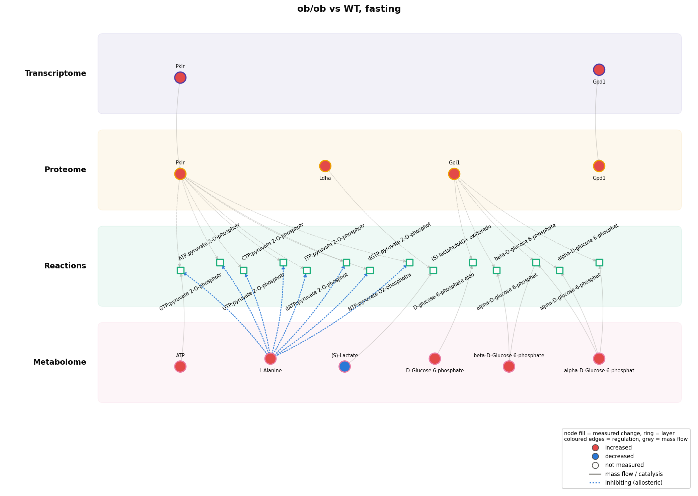
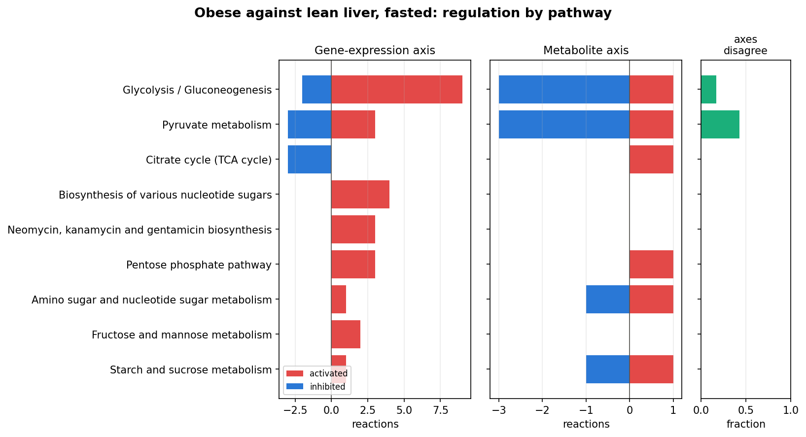
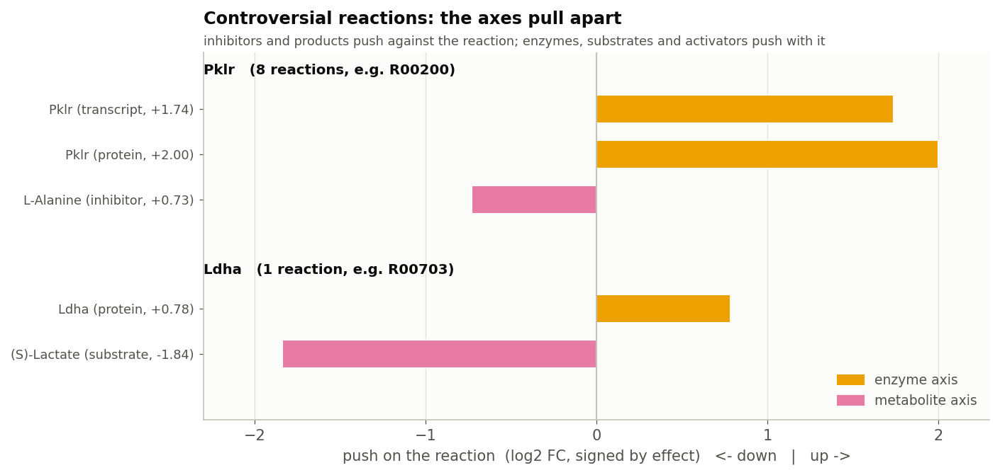
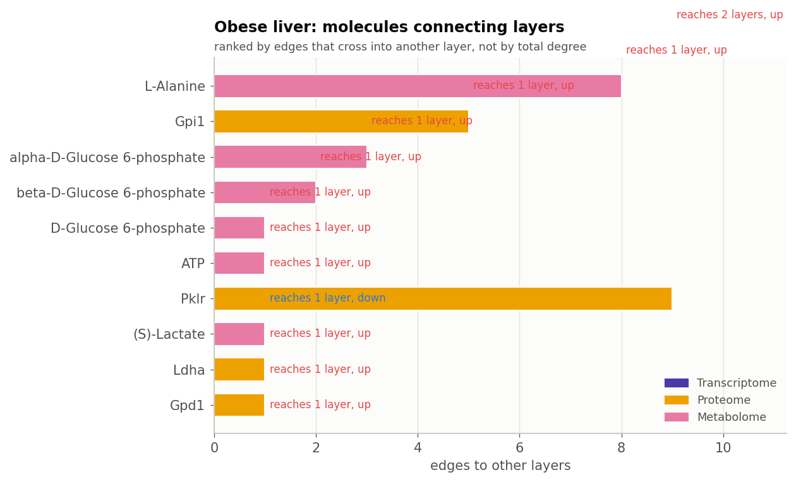
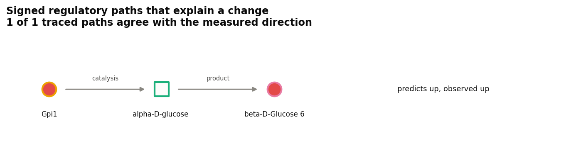
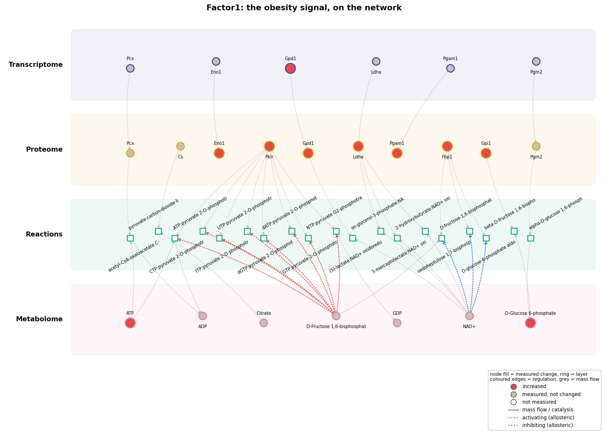
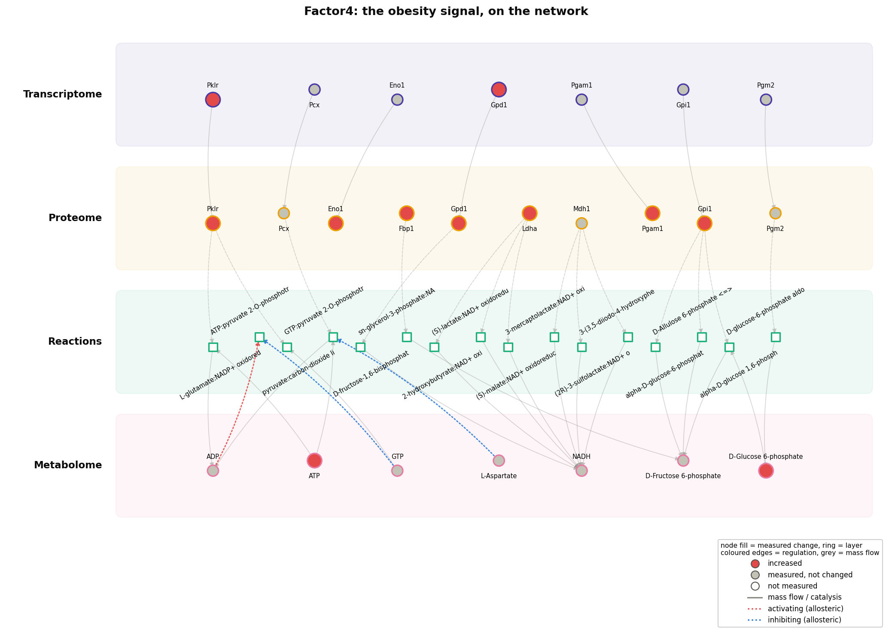

.. _obese-liver-panel:

Obese liver after a glucose load: a 19-gene metabolic panel
===========================================================

.. list-table::
   :widths: 22 78

   * - **Question**
     - Does a trans-omic analysis answer questions that a separate analysis of
       each layer cannot, and are its answers right?
   * - **System**
     - Liver of wild-type and leptin-deficient obese (ob/ob) mice, fasted and
       4 h after an oral glucose load; 11-12 mice per group
   * - **Layers**
     - Transcriptome, proteome and metabolome, measured in the same animals: 19
       enzyme genes of central carbon metabolism, their proteins, 32
       metabolites
   * - **Data**
     - :ref:`Uematsu et al. 2022 <ref-uematsu2022>`, *iScience*
   * - **Network**
     - The organism-wide mouse network, restricted to the panel's
       neighbourhood
   * - **Notebook**
     - :doc:`studies/obese_liver`, with every table and figure

This page is the summary. Run the analysis with:

.. code-block:: bash

    python notebooks/studies/obese_liver.py

.. admonition:: Provenance of the data and of these figures

   The measurements are those of Uematsu *et al.*, published with their OMELET
   code under GPL-3.0. TransNet is MIT-licensed and **never redistributes
   them**: the script downloads the files when it runs, into a directory that is
   not part of this repository.

   The figures on this page are TransNet's own: fold changes, tests and
   intervals computed here from those measurements. None of the authors' code
   is run, and none of their data files are reproduced.

The data
--------

The panel covers glycolysis, gluconeogenesis, the pyruvate cycle and the TCA
cycle. It is mapped onto the organism-wide mouse network built by
``maintenance/build_networks.py --organisms mouse --brenda``: the panel's genes,
their proteins, the 58 reactions those enzymes catalyse, and every metabolite
that takes part in or regulates those reactions. A molecule counts as changed at
:math:`|\log_2 FC| \geq 0.585` (1.5-fold) and :math:`q \leq 0.1`, the
definition the Kuroda laboratory uses.

This neighbourhood has 221 molecules joined by 387 edges, and **every edge
connects two different layers**: 19 from transcript to protein, 66 from protein
to reaction, and 302 between reactions and metabolites. There are no protein
interaction edges among 19 enzymes. The limit is coverage, and it is uneven: all
19 transcripts and 17 of 19 proteins are measured, but only 32 of the 125
metabolites that the panel's reactions involve.

What a per-layer analysis says
------------------------------

For obese against lean liver, fasted: **3 transcripts, 8 proteins and 6
metabolites changed**, and 2 genes appear in both the transcript and the protein
list. In the glucose response of lean liver, 2 metabolites change and nothing
else; in the glucose response of obese liver, nothing changes.

That is all that separate lists of changed molecules can say. They cannot say
which reactions are affected, through which mechanism, or whether the layers
agree. Those are the questions the published papers ask.

What the trans-omic network says
--------------------------------

.. list-table::
   :header-rows: 1
   :widths: 24 30 46

   * - Question
     - Per-layer analysis
     - Trans-omic network
   * - Which reactions are affected?
     - not answerable
     - 49 of 58, named
   * - Through which mechanism?
     - not answerable
     - 31 through enzyme amount only, 5 through metabolites only, 13 through
       both (:ref:`reaction regulation axes <regulation-axes>`)
   * - Do the layers agree?
     - not answerable
     - 9 controversial reactions, catalysed by 2 enzymes, where the enzyme
       and metabolite axes point in opposite directions
   * - Are the protein changes transcriptional?
     - an overlap of two lists
     - 2 concordant; 6 changed at the protein level only, of which 4 (Ldha,
       Eno1, Gpi1, Fbp1) changed significantly more than their transcript when
       tested directly; Pck1 and Pgam1 did not, because their transcripts
       changed nearly as much
   * - How does obesity change regulation?
     - more or fewer changed molecules
     - a shift from metabolite-driven to enzyme-driven regulation

   Fasting obese liver against lean liver, as a trans-omic network: the panel's
   genes, their enzymes, the reactions they catalyse and the metabolites of
   those reactions, in the order regulation flows.

Which axis regulates each reaction
----------------------------------

Most regulated reactions change through the amount of their enzyme. Grouped by
KEGG pathway, glycolysis and gluconeogenesis carry the most regulated reactions:
9 activated and 2 inhibited on the enzyme axis, and 1 activated and 3 inhibited
on the metabolite axis. Pyruvate metabolism has the highest share of
controversial reactions.

   Regulated reactions per KEGG pathway. Left, the enzyme axis; middle, the
   metabolite axis (red: the axis speeds the reaction up; blue: slows it down);
   right, the fraction of the pathway's regulated reactions where the two axes
   disagree.

The controversial reactions come down to two enzymes, and each points to a
specific mechanism:

**Pyruvate kinase is pushed in both directions.** Obese liver has more of the
enzyme (transcript up 1.74 log2, protein up 2.00), and also more alanine
(+0.73), its classic allosteric inhibitor in liver. The extra enzyme is held back
by the extra inhibitor. This is the regulation that limits wasteful cycling
between pyruvate and phosphoenolpyruvate while the liver makes glucose. Alanine
is found as a regulator only because TransNet resolves BRENDA's spelling,
"L-Ala", to the KEGG compound.

**Lactate dehydrogenase rises while its substrate falls.** Ldha protein is up
0.78 log2, but lactate is down 1.84. This is consistent with lactate being used
faster for glucose production, a hypothesis that a flux measurement could test.

   The two controversial enzymes. Each bar is one measured molecule's push on
   the reaction: to the right it speeds the reaction up, to the left it slows it
   down. Yellow bars are the enzyme axis, pink bars the metabolite axis.

**Changed metabolites that regulate enzymes.** Of the 7 changed metabolites,
only alanine is a known allosteric regulator (14 %, against 25 % of all measured
metabolites; not enriched). On this panel the metabolite axis is carried mainly
by substrates and products, not by allosteric regulators.

The molecules that connect the layers
-------------------------------------

**Cross-layer hubs.** On a panel this size the ranking is short: pyruvate kinase
leads with 9 connections to other layers, spanning two layers, followed by
alanine with 8, then glucose-6-phosphate isomerase and the two forms of glucose
6-phosphate. These are the same molecules the findings above turn on, which is
a check on the ranking rather than a separate result.

   Molecules ranked by their connections to other layers, coloured by layer.

**What the panel cannot show.** Several analyses return nothing here, and each
time the reason is the panel's coverage, not the biology:

* The motif search finds no product inhibition, allosteric feedback or
  feed-forward loop among the changed molecules.
* Transcription-factor inference has nothing to test: no
  transcription-factor edge reaches any of the 19 genes.
* No single molecule holds the responsive network together: with every edge
  crossing a layer and no long chains, there is nothing to cut.
* Path tracing and propagation both reach exactly one changed metabolite,
  beta-D-glucose 6-phosphate, through Gpi1 and glucose-6-phosphate isomerase.
  Its direction is predicted correctly, which with a single case says nothing
  (p = 1). With 7 changed metabolites among 125, neither method has material
  to work with.

   The one signed path that reaches a changed metabolite.

**Is the convergence more than chance?** 14 reactions have a change on both
axes. Reassigning at random which molecules changed, with the network and the
number of changes per layer fixed, gives 6.3 on average (z = +1.9, p = 0.050).
That is only just significant; the genome-wide studies show much stronger
convergence.

The published claims, checked
-----------------------------

.. list-table::
   :header-rows: 1
   :widths: 34 16 50

   * - Claim
     - Verdict
     - TransNet result
   * - Healthy hepatic glucose responses rely on regulation by metabolites
       (:ref:`Kokaji et al. 2020 <ref-kokaji2020>`)
     - reproduced
     - 6 reactions regulated in the lean glucose response, all through
       metabolites
   * - In ob/ob liver, regulation by metabolites is lost
       (:ref:`Kokaji et al. 2020 <ref-kokaji2020>`)
     - reproduced, weakly
     - 0 metabolite-axis reactions against 6 in lean liver; weak support,
       because nothing changes in any layer in the obese glucose response
   * - ob/ob glucose responses depend instead on slow gene expression
       (:ref:`Kokaji et al. 2020 <ref-kokaji2020>`)
     - not testable on this panel
     - no enzyme-axis reactions; one 4 h time point and 19 genes, against the
       paper's genome-wide time course. Tested in :doc:`liver_timecourse`.
   * - Fasting ob/ob liver is rewired through enzyme amount rather than
       metabolites (:ref:`Uematsu et al. 2022 <ref-uematsu2022>`)
     - reproduced
     - 90 % of regulated reactions change through enzymes, 37 % through
       metabolites
   * - ... and specifically through increased transcripts
       (:ref:`Uematsu et al. 2022 <ref-uematsu2022>`)
     - **not reproduced**
     - 10 of 44 enzyme-axis reactions have a transcript changing the same way;
       34 change at the protein level only
   * - The pyruvate cycle is regulated through both transcripts and metabolites
       (:ref:`Uematsu et al. 2022 <ref-uematsu2022>`)
     - reproduced
     - pyruvate kinase is regulated on both axes
   * - ~54 % of regulated liver reactions are controversial in fasting ob/ob
       mice (:ref:`Egami et al. 2021 <ref-egami2021>`)
     - not testable on this panel
     - 9 of 49 (18 %), from 2 enzymes; 19 central-carbon enzymes against 673
       reactions genome-wide
   * - Increased gluconeogenic flux arises primarily from increased transcripts
       (:ref:`Uematsu et al. 2022 <ref-uematsu2022>`)
     - out of scope
     - a claim about *flux*, which TransNet does not model

**4 of the 5 claims that this panel can test are reproduced.** The claim
that is not reproduced, and the two that the panel cannot test, are both
informative:

* The claim that obesity acts through *transcripts* is contradicted without
  depending on a significance cut-off. Tested directly (protein change minus
  transcript change, with standard errors), Gpi1, Fbp1, Eno1 and Ldha changed
  significantly more than their transcripts, while Pklr and Gpd1 changed through
  their transcripts. Bootstrap 95 % intervals show the same:

  .. figure:: figures/obese_liver_panel/concordance.png
     :width: 100%

     Protein change against transcript change for each gene measured in both
     layers, coloured by category.

  Uematsu *et al.* reached "transcripts" through a flux model, which TransNet
  does not have; the data here test the claim about enzyme *amounts*.
* Two claims come from genome-wide studies with several time points. A 19-gene
  panel at one time point cannot test them, so the verdict is "not testable on
  this panel", not "wrong". :doc:`liver_timecourse` tests them on the
  genome-wide data.

.. figure:: figures/obese_liver_panel/axes_by_contrast.png
   :width: 100%

   Regulated reactions by axis in each of the three contrasts: lean liver's
   glucose response relies on metabolites, fasting obese liver on enzyme amount.

Factors, and whether the pairing matters
----------------------------------------

A joint factor model assumes that each column is the same mouse in every file.
The authors describe the layers as measured in the same animals, and the data
point that way: the per-gene agreement between transcript and protein is 0.066
as listed, against −0.004 under shuffled pairings. With only 17 genes in both
layers, however, the check is not significant (p = 0.098). The pairing is
neither confirmed nor refuted.

This limits which factors can be interpreted, not whether any can. A factor
carried by genotype or glucose, whose labels are certain, keeps its agreement
between layers however the mice within a group are re-paired, so it can be
interpreted either way. :func:`~transnet.analysis.factors.pairing_robustness`
separates the four NMF factors clearly:

.. list-table::
   :header-rows: 1
   :widths: 14 18 22 22 24

   * - Factor
     - Genotype η²
     - Layers agree
     - Retained when re-paired
     - Carried by
   * - Factor1
     - 0.73
     - 0.74
     - 96%
     - between-group
   * - Factor4
     - 0.80
     - 0.74
     - 96%
     - between-group
   * - Factor2
     - 0.46
     - 0.27
     - --
     - single-layer
   * - Factor3
     - 0.68
     - −0.04
     - --
     - single-layer

.. figure:: figures/obese_liver_panel/factor_scores.png
   :width: 100%

   Four factors across the design: lean and obese, fasted and 4 h after
   glucose.

**Factors 1 and 4 are the obesity signal, carried by genotype and by all three
layers together**, and can be interpreted whatever the pairing. Factors 2 and 3
also follow genotype, but the layers do not agree about them: each is one layer's
view of the difference, not a trans-omic factor.

On the network, the two robust factors are different signals. Factor1
concentrates on citrate, glucose 6-phosphate and fructose 1,6-bisphosphate, with
phosphoglucomutase and citrate synthase beside them: the entry points of
gluconeogenesis and the TCA cycle. Factor4 concentrates on fructose 6-phosphate
and glucose 6-phosphate but also includes glutamate and aspartate, the
transamination route into gluconeogenesis. Both have more direct network links
than chance (1.18x and 1.24x), but neither is significant on a network of 221
molecules (q = 0.42 and 0.40).

   Factor1 on the network: where its transcripts, proteins, reactions and
   metabolites meet.

   Factor4, which adds the amino acids of the transamination route.

What this study does not cover
------------------------------

Several claims in this literature concern metabolic *flux*, which needs a
kinetic or flux model. TransNet does not build such models, so those claims are
marked "out of scope" rather than tested.
