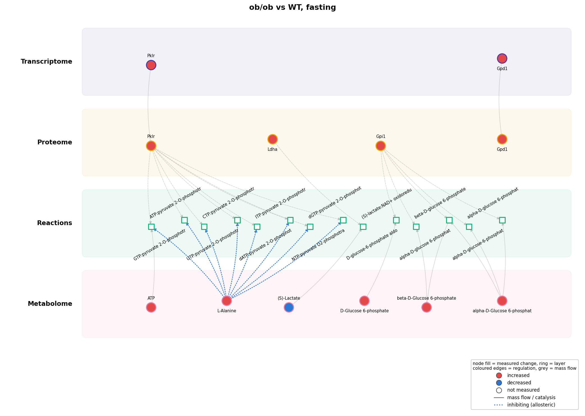
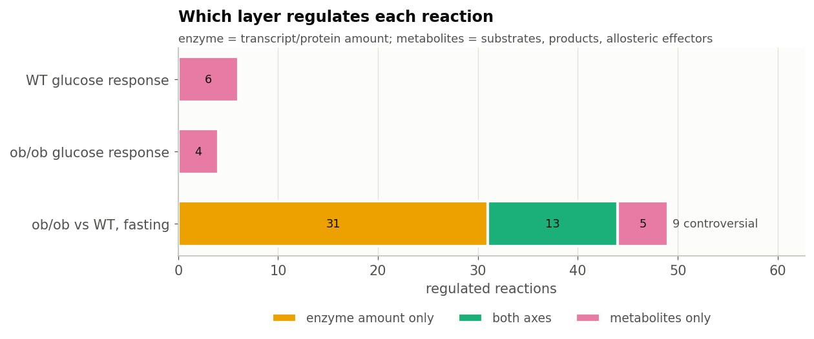
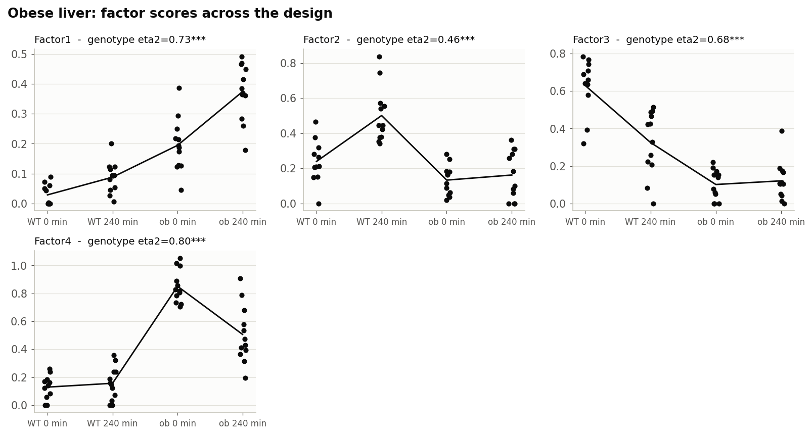
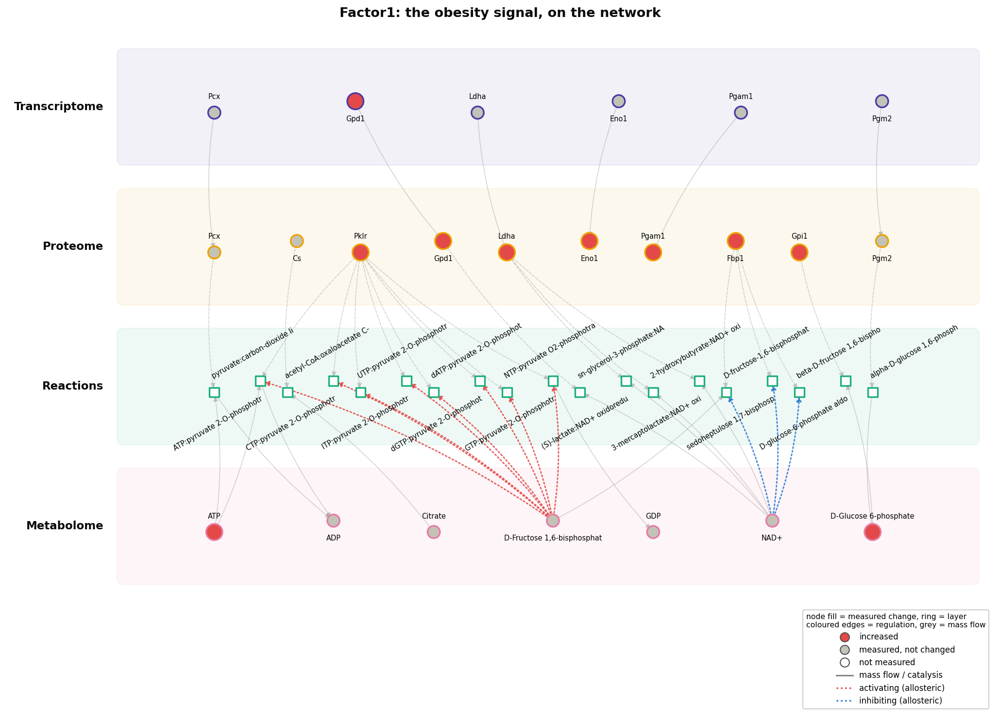
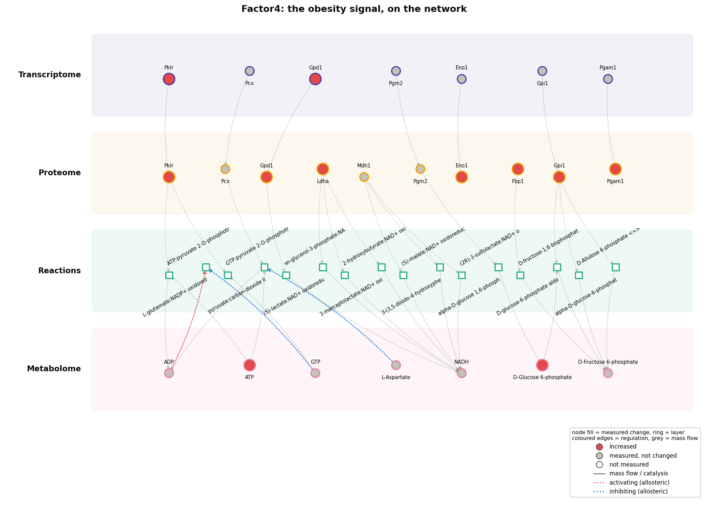

.. _published-study:

Reproducing a published study
=============================

This page tests two things on published data: whether a trans-omic analysis
answers questions a per-layer analysis cannot, and whether it gets the answers
right.

.. code-block:: bash

    python notebooks/studies/obese_liver.py

.. tip::

   This page is the summary. :doc:`The full notebook <studies/obese_liver>`
   runs every analysis in the catalogue on this data, with all of its tables
   and figures: the sample pairing check that decides whether a factor model is
   allowed, the regulatory motifs and the convergence null.

The data
--------

:ref:`Uematsu et al. 2022 <ref-uematsu2022>` measured liver transcriptome,
proteome and metabolome **in the same animals**: wild-type and leptin-deficient
obese (ob/ob) mice, fasted and 4 h after oral glucose, 11-12 mice per group. The
panel covers glycolysis, gluconeogenesis, the pyruvate cycle and the TCA cycle:
19 enzyme genes, their proteins, and 32 metabolites.

.. admonition:: Provenance of the data and of these figures

   The measurements are those of Uematsu *et al.*, published with their OMELET
   code under GPL-3.0 and cited below. TransNet is MIT-licensed and **never
   redistributes them**: the script downloads the files at run time into a
   directory that is not part of this repository.

   The figures on this page are TransNet's own: fold changes, tests and
   intervals computed here from those measurements, drawn by this package. None
   of the authors' code is run, and none of their data files are reproduced.

The panel is mapped onto the organism-wide mouse network built by
``maintenance/build_networks.py --organisms mouse --brenda``: its genes, their
proteins, the 58 reactions those enzymes catalyse, and every metabolite on or
regulating those reactions. Molecules are called changed at
:math:`|\log_2 FC| \geq 0.585` (1.5-fold) and :math:`q \leq 0.1`, the
definition the Kuroda laboratory uses.

The panel neighbourhood is 221 molecules joined by 387 relationships, and
**every one of those edges crosses a layer**. With no interactome edges inside
the Proteome, a panel this focused is pure trans-omic wiring: 19 transcript to
protein, 66 protein to reaction, 302 between reactions and metabolites. Layer
coverage is the constraint and it is asymmetric: all 19 transcripts and 17 of
19 proteins are measured, but only 32 of the 125 metabolites the panel's
reactions touch.

What a per-layer analysis says
------------------------------

For obese against lean liver, fasted: **3 transcripts, 8 proteins and 6
metabolites changed**, 2 genes shared between the transcript and protein lists.
The glucose response of wild-type liver changes 2 metabolites and nothing else;
the obese glucose response changes nothing.

That is everything analysing the layers separately can say. It cannot say which
reactions are affected, through which mechanism, or whether the layers agree.
Those are the questions the published papers ask.

What the trans-omic network says
--------------------------------

.. list-table::
   :header-rows: 1
   :widths: 24 30 46

   * - Question
     - Per-layer analysis
     - Trans-omic network
   * - Which reactions are affected?
     - not answerable
     - 49 of 58, named
   * - Through which mechanism?
     - not answerable
     - 31 through enzyme amount only, 5 through metabolites only, 13 through
       both (:ref:`reaction regulation axes <regulation-axes>`)
   * - Do the layers agree?
     - not answerable
     - 2 enzymes where the enzyme and metabolite axes point opposite ways
   * - Are protein changes transcriptional?
     - an overlap of two lists
     - 2 concordant; 6 changed at the protein level only, of which 4 --
       Ldha, Eno1, Gpi1, Fbp1 -- moved significantly further than their
       transcript when tested directly; Pck1 and Pgam1 did not, their
       transcripts having moved nearly as far (transcript-protein concordance)
   * - How does obesity change regulation?
     - more or fewer changed molecules
     - a shift from metabolite- to enzyme-driven regulation

Two findings no list of changed molecules contains:

   Fasting obese liver against wild type, as a trans-omic network: the panel's
   genes, their enzymes, the reactions they catalyse and the metabolites on
   those reactions, in the order regulation flows.

**Pyruvate kinase is pulled in both directions.** Obese liver has more of it --
transcript up 1.74, protein up 2.00 log2 -- and also more alanine (+0.73), its
classic allosteric inhibitor in liver. More enzyme, more brake: the regulation
that restrains futile pyruvate cycling while the liver makes glucose. Alanine
reaches the network only because BRENDA writes it "L-Ala", which TransNet now
resolves.

**Lactate dehydrogenase rises while its substrate falls.** Ldha protein is up
0.78 but lactate is down 1.84 log2 -- consistent with lactate being drawn into
gluconeogenesis faster, a hypothesis a flux measurement could test.

   Every reaction whose two axes disagree in fasting obese liver, with the
   enzymes and metabolites pushing each way.

Which molecules join the layers, and what the wiring says
---------------------------------------------------------

**Cross-layer hubs.** On a panel this size the ranking is short and sharp:
pyruvate kinase PKLR leads with a cross-layer degree of 9 across two layers,
alanine follows with 8, then glucose-6-phosphate isomerase and the two anomers
of glucose 6-phosphate. The molecules the network singles out are the same ones
the findings below turn on, which is a check on the ranking rather than a
separate result.

**Motifs.** The motif search finds nothing: no product inhibition, no
allosteric feedback, no feed-forward loop where both the transcription factor
and its enzyme responded. Transcription-factor inference is likewise empty, 0 of
0 testable, because no transcriptional-regulation edge reaches one of the 19
measured genes. Both are coverage limits of a targeted panel, and the
notebook says so rather than reporting an absence as a finding.

**Is the convergence real?** 14 reactions carry a change on both axes; shuffling
which molecules changed, while holding the network and the per-layer counts
fixed, gives 6.3 (z = +1.9, p = 0.050). That is at the edge of significance,
where the genome-wide studies show strong convergence.

**Structural vulnerability** returns nothing: the responsive subnetwork has no
articulation point, so no single molecule holds it together. On 221 nodes with
every edge crossing a layer, there is no long chain to cut.

.. figure:: figures/published/regulatory_paths.png
   :width: 100%

**Paths and propagation** both run out of material. Exactly one changed
metabolite is reachable from the changed genes and proteins: beta-D-glucose
6-phosphate, by the single route Gpi1 to glucose-6-phosphate isomerase to glucose
6-phosphate. Its direction is predicted correctly, which on n = 1 says nothing
(p = 1). With 7 responsive metabolites on a 125-node metabolite
layer there is nothing for either method to work with, and that is a coverage
statement about the panel, not about the methods.

The published claims, checked
-----------------------------

.. list-table::
   :header-rows: 1
   :widths: 34 16 50

   * - Claim
     - Verdict
     - TransNet result
   * - Healthy hepatic glucose responses rely on regulation by metabolites
       (:ref:`Kokaji et al. 2020 <ref-kokaji2020>`)
     - reproduced
     - 6 reactions regulated, all through metabolites
   * - In ob/ob liver, regulation by metabolites is lost (:ref:`Kokaji et al. 2020 <ref-kokaji2020>`)
     - reproduced
     - 0 metabolite-axis reactions against 6 in WT -- weak support, since
       nothing in the obese glucose response changes in any layer
   * - ob/ob glucose responses instead depend on slow gene expression
       (:ref:`Kokaji et al. 2020 <ref-kokaji2020>`)
     - not reproduced here; see :doc:`kokaji_study`
     - no enzyme-axis reactions; one 4 h timepoint and 19 genes, against the
       paper's genome-wide time course
   * - Fasting ob/ob liver is rewired through enzyme amount rather than
       metabolites (:ref:`Uematsu et al. 2022 <ref-uematsu2022>`)
     - reproduced
     - 90% of regulated reactions via enzymes, 37% via metabolites
   * - ... and specifically through increased transcripts (:ref:`Uematsu et al. 2022 <ref-uematsu2022>`)
     - **not reproduced**
     - 10 of 44 enzyme-axis reactions have a transcript changing the same way;
       34 change at protein level only
   * - The pyruvate cycle is regulated through both transcripts and metabolites
       (:ref:`Uematsu et al. 2022 <ref-uematsu2022>`)
     - reproduced
     - pyruvate kinase on both axes
   * - ~54% of regulated liver reactions are controversial in fasting ob/ob
       mice (:ref:`Egami et al. 2021 <ref-egami2021>`)
     - not reproduced here
     - 9 of 49 (18%), 2 enzymes; 19 central-carbon enzymes against 673
       genome-wide reactions
   * - Increased gluconeogenic flux arises primarily from increased transcripts
       (:ref:`Uematsu et al. 2022 <ref-uematsu2022>`)
     - out of scope
     - a claim about *flux*; flux modelling is not part of this project, so
       it is not scored

**4 of 7 testable claims reproduced.** The failures are informative rather than
embarrassing:

* The transcript claim is contradicted without relying on a threshold. Tested
  directly -- protein change minus transcript change, with standard errors --
  Gpi1, Fbp1, Eno1 and Ldha moved significantly further than their
  transcripts, while Pklr and Gpd1 changed transcriptionally. Bootstrap 95%
  intervals show the same:

  .. figure:: figures/published/concordance.png
     :width: 100%

  Uematsu *et al.* reach "transcripts" through a flux model, which is outside
  this project; the claim about enzyme *amounts* is what the data test.
* Two claims come from genome-wide, multi-timepoint studies. A 19-gene panel at
  one timepoint is the wrong instrument for them; the verdict says "not
  reproduced here", not "wrong".

Factors, and whether the pairing matters
----------------------------------------

A joint factor model treats each column as the same mouse in every file. The
design rows match and the authors describe the layers as measured in the same
individuals; the data lean that way -- per-gene agreement 0.066 as listed against
−0.004 under shuffled pairings -- but with only 17 genes in both layers the check
does not reach significance (p = 0.098). The pairing is neither confirmed nor
refuted.

That limits which factors can be read, not whether any can. A factor carried by
genotype or glucose -- whose labels are certain -- keeps its cross-layer
agreement however the mice within a group are re-paired, and is interpretable
either way. :func:`~transnet.analysis.factors.pairing_robustness` separates
the four NMF factors cleanly:

.. list-table::
   :header-rows: 1
   :widths: 14 18 22 22 24

   * - Factor
     - Genotype η²
     - Layers agree
     - Retained when re-paired
     - Carried by
   * - Factor1
     - 0.73
     - 0.74
     - 96%
     - between-group
   * - Factor4
     - 0.80
     - 0.74
     - 96%
     - between-group
   * - Factor2
     - 0.46
     - 0.27
     - --
     - single-layer
   * - Factor3
     - 0.68
     - −0.04
     - --
     - single-layer

   Four factors across the design: wild-type and ob/ob, fasted and 4 h after
   glucose.

**Factors 1 and 4 are the obesity signal, carried by genotype and by all three
layers together**, and are interpretable whatever the pairing. Factors 2 and 3
also follow genotype, but the layers do not agree about them: each is one
layer's view of the difference, not a trans-omic factor.

Read on the network, the two robust factors are not the same signal. Factor1
concentrates on citrate, glucose 6-phosphate and fructose 1,6-bisphosphate with
phosphoglucomutase and citrate synthase beside them, which are the
gluconeogenic and TCA entry points. Factor4 concentrates on fructose 6-phosphate and glucose
6-phosphate but brings glutamate and aspartate with it, the transamination
route into gluconeogenesis. Both make more direct network links than chance
(1.18x and 1.24x), though neither reaches significance on a panel this small
(q = 0.42 and 0.40) on a 221-node network.

   Factor1 on the network: where its transcripts, proteins, reactions and
   metabolites meet.

   Factor4, the transamination-flavoured counterpart.

What the literature does beyond this
------------------------------------

Flux modelling is out of scope for this project; see *Out of scope* in
:doc:`transomics_analyses`.
